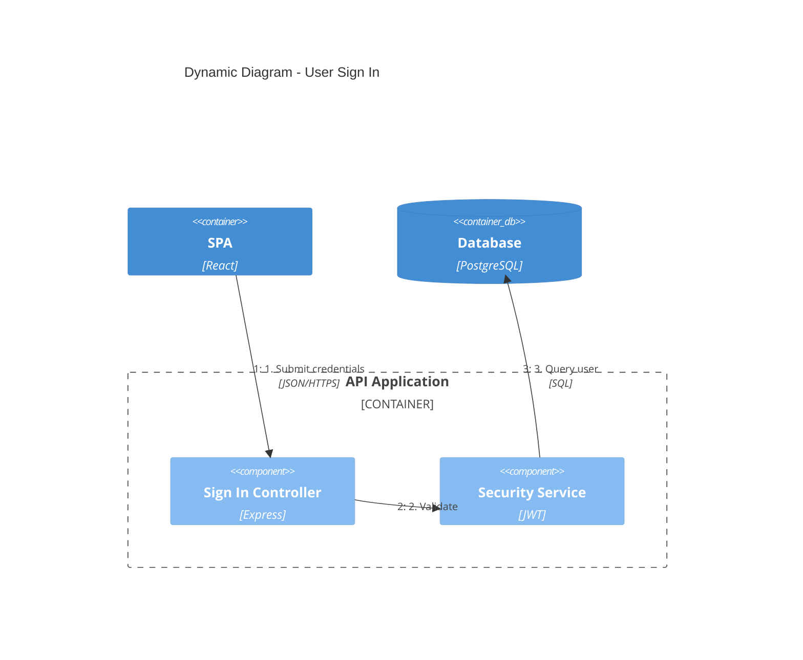
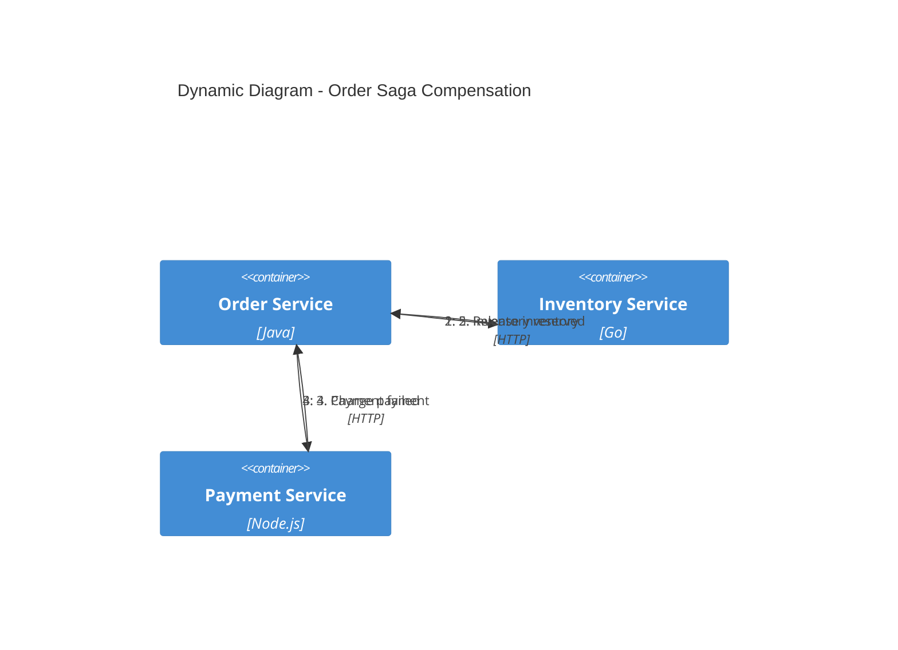
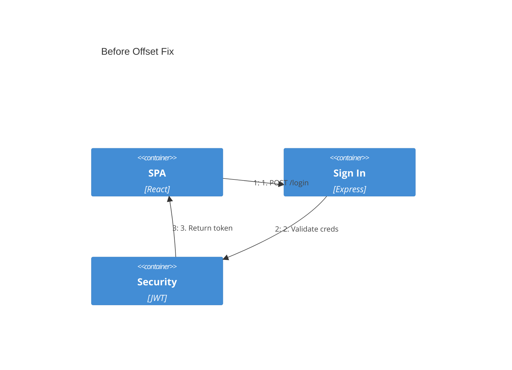

# C4Dynamic Diagrams

## When to Use

C4Dynamic shows **numbered sequence steps** within a container or component boundary. Use for:

- Complex request flows (auth, checkout, registration)
- Error handling and circuit breaker flows
- Saga compensation sequences
- Event-driven choreography sequences

Do NOT use for: simple 2-3 step flows (use a labeled Rel instead). For simple flows, a labeled `Rel` on a C4Container or C4Component diagram suffices — no numbered steps needed.

Use a standard Mermaid sequenceDiagram for cross-container flows or when you don't need C4 element types. Use C4Dynamic when the flow stays within a container boundary and you want C4 context.

## Syntax

> **Note:** C4Dynamic requires the C4 plugin for Mermaid. In Structurizr DSL (which dev-flow uses for workspace.dsl), C4Dynamic is not used — use Structurizr's native component views instead. This reference applies when writing Mermaid C4 in markdown files.

### Diagram Declaration

```
C4Dynamic
  title {Diagram Title}
```

### Elements

```
Container(name, "Label", "Technology", "Description")
Component(name, "Label", "Technology", "Description")
ContainerDb(name, "Label", "Technology", "Description")
Container_Boundary(alias, "Label") { ... }
```

### Relationships

```
Rel(from, to, "N. Step description", "Technology")
UpdateRelStyle(from, to, $offsetX, $offsetY)
```

## Common Patterns

### Pattern 1: Authentication Flow



### Pattern 2: Saga Compensation



## Layout Tips

- Use `$offsetY="-30"` to fix overlapping labels
- Keep steps under 10 per diagram
- One entry point (leftmost), external deps (rightmost)
- Use `Container_Boundary` to scope the system under consideration

### Layout Fix Example

When labels overlap, use `UpdateRelStyle` to nudge the relationship line:




The `UpdateRelStyle` call adjusts the bend point of the relationship line:
```
UpdateRelStyle(spa, signIn, $offsetY="-30")
```
