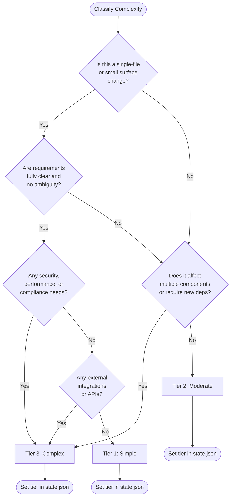

# Complexity Ladder

This document defines the complexity classification system used to determine which phases run and how they are executed.

## Three Tiers

### Tier 1 — Simple

**Criteria**: The task is a straightforward enhancement with no architectural implications.

- Single file or small surface area change
- No new dependencies required
- No external integrations or API changes
- Clear requirements with no ambiguity
- No security, performance, or compliance considerations

**Phases to run**: 1, 6, 8 (Discovery, Implementation, Completion)

**Phases to skip**: 2, 3, 4, 7

**Phase modifications**:
- Phase 3 (Design) is replaced with a lightweight note in the approach document listing the changed files and any interface considerations
- Phase 4 (Pre-Mortem) is skipped entirely
- Phase 5 (Planning) is **replaced** with a single-screen task list in the approach document — it runs but produces reduced-scope artifacts
- Phase 5b (Pre-Implementation Gate) **always runs** — it is a HARD-GATE and cannot be skipped

### Tier 2 — Moderate

**Criteria**: The task involves new functionality, multiple components, or meaningful changes to existing behavior.

- Multiple components or files affected
- May require new dependencies (with approval)
- Some external integrations possible
- Requirements mostly clear but some ambiguity exists
- Basic security or performance considerations

**Phases to run**: 1, 2, 3, 4, 5, 5b, 6, 7, 8 (all 8 phases — no skips)

**Phase modifications**:
- No phases skipped or replaced — Tier 2 runs the full process

### Tier 3 — Complex

**Criteria**: The task has significant architectural implications, multiple integrations, or high-stakes requirements.

- Significant architectural change or new system design
- Multiple external integrations
- Security, performance, or compliance requirements
- Unclear requirements requiring extensive exploration
- Team coordination required

**Phases to run**: All 8 phases (1, 2, 3, 4, 5, 5b, 6, 7, 8)

**Phase modifications**:
- Phase 3 (Design) must include a component diagram showing all major components and their interactions
- Phase 4 (Pre-Mortem) includes expanded risk analysis with failure mode annotations per component
- Phase 7 (Gap Analysis) includes all standard gap categories **plus**:
  - Full regression test suite run (all 7 test types from `references/testing-pyramid.md` must pass)
  - CQRS compliance check: verify that read and write operations are properly separated
  - Architecture compliance check: verify all named patterns (saga, outbox, idempotent consumer) are used correctly per `why/NAMED_PATTERNS.md`

---

## Decision Tree

Use this flowchart to classify the complexity tier:



### Five Decision Questions

1. **Is this a single-file or small surface change?** If yes, continue to Q2. If no, proceed to Q3.
2. **Are requirements fully clear with no ambiguity?** If yes, continue to Q4. If no, this suggests Tier 2 or 3 — proceed to Q3.
3. **Does it affect multiple components or require new dependencies?** If yes, this is likely Tier 3. If no, Tier 2.
4. **Are there security, performance, or compliance needs?** If yes, Tier 3. If no, continue to Q5.
5. **Are there external integrations or API changes?** If yes, Tier 3. If no, Tier 1.

---

## Quality Gate Variations by Tier

Tier-specific gate variations **modify** the phase-specific quality gate checklists. They do not replace them. The agent always runs the phase-specific gate checklist first, then applies tier-specific additions.

**Tier 1 Quality Gate Modifications**:
- Phase 1: Approach doc with changed files listed (full alternatives analysis not required)
- Phase 6: Lightweight verification (does it work? — no full spec review required)
- Phase 8: Completion report with change summary (no retrospective needed)

**Tier 2 Quality Gate Modifications**:
- Phase 1: Approach doc with alternatives considered
- Phase 2: Exploration findings documented
- Phase 3: C4 context diagram complete
- Phase 5: Task list with dependencies identified
- Phase 6: Standard TDD verification (per-task loop as defined in Phase 6)
- Phase 8: Full completion report

**Tier 3 Quality Gate Modifications**:
- Phase 1: Approach doc with risk assessment
- Phase 2: Exploration findings with system boundaries identified
- Phase 3: Full C4 model (context, container, component, deployment) + component diagram required
- Phase 4: Expanded pre-mortem with failure mode annotations per component
- Phase 5: Task list with risk annotations per task
- Phase 6: TDD + integration testing verification (standard per-task loop)
- Phase 7: Full gap analysis + regression suite + CQRS + architecture compliance checks (see Tier 3 Phase 7 modifications above)
- Phase 8: Full completion report with lessons learned

## Phase Skipping Protocol

When a phase is skipped or replaced, the agent must record the skip in `state.json` to maintain traceability.

### Key Distinction: Skip vs Replace

- **Skip**: The phase does not run at all. No artifacts are produced.
- **Replace**: The phase runs in a modified form. Artifacts are still produced, but with reduced scope.

Phase 5 is **replaced** (not skipped) for Tier 1 — a lightweight task list is produced in the approach document. Phase 5b is **never skipped** — it always runs as the Pre-Implementation HARD-GATE, regardless of tier.

### How to Record Skips and Replacements

Add entries to the `phasesSkipped` array in the `metadata` block:

```json
"metadata": {
  "complexityTier": "simple",
  "phasesSkipped": [
    {
      "phase": 2,
      "reason": "Single-file change, no exploration needed",
      "skippedAt": "2026-03-28T10:00:00Z"
    },
    {
      "phase": 5,
      "reason": "Replaced with lightweight task list (Tier 1)",
      "skippedAt": "2026-03-28T10:00:00Z",
      "replacedWith": "single-screen task list in approach.md"
    }
  ],
  "skipReason": null
}
```

### Skip Recording Rules

1. **Record immediately** when the skip/replacement is determined (during Step 1.2)
2. **Include the phase number** and a brief reason
3. **Mark as `replacedWith`** if the phase still runs in lightweight form (e.g., Tier 1 Phase 5)
4. **Phase 5b is never recorded as skipped** — it is a HARD-GATE and always runs
5. **Do not skip recording** — even if the skip seems obvious, document it for auditability

---

## Adapters and Complexity

**Important**: Fake adapters ALWAYS apply regardless of complexity tier.

This means:
- If the project uses SQLite in development and Postgres in production, the fake adapter (SQLite) is used regardless of whether this is Tier 1, 2, or 3
- Adapters are a non-negotiable architectural pattern, not a complexity-based option
- The complexity tier determines which phases run and how thoroughly each is executed — it does not override the adapter pattern

See `why/WALKING_SKELETON.md` for the full fake adapter specification and swap protocol.
