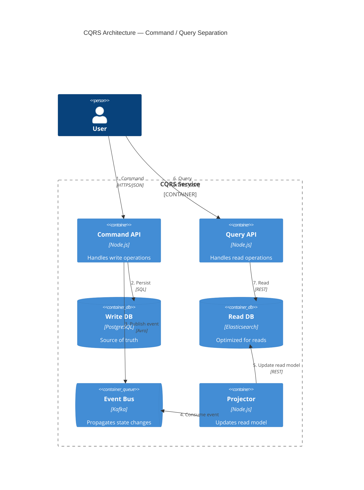

# CQRS and Related Patterns Reference

> **Layer-scaffold is canonical for file structure.** See `references/layer-scaffold.md`. This doc covers CQRS and related backend domain patterns — it does NOT define where files live. File placement follows layer-scaffold.

This document covers CQRS, event sourcing, sagas, outbox pattern, and idempotent consumers — patterns essential for building distributed, event-driven systems.

---

## Section 1: CQRS — Command Query Responsibility Segregation



### Core Idea

CQRS separates read (query) and write (command) models into distinct abstractions. The key insight is that reads and writes have fundamentally different requirements:

- **Writes** need to enforce business rules, validate constraints, and update state
- **Reads** need to format data for specific use cases, potentially joining across many entities

CQRS does NOT mean separate databases (though you CAN have separate read/write stores). The pattern is about the models themselves being different shapes.

```typescript
// Write Model: Normalized, rich domain structure
interface OrderAggregate {
  id: OrderId;
  customerId: CustomerId;
  lineItems: LineItem[];
  status: OrderStatus;
  version: number; // For optimistic concurrency
}

// Read Model: Denormalized, optimized for specific query
interface OrderSummaryView {
  orderId: string;
  customerName: string;
  totalAmount: number;
  itemCount: number;
  statusDisplay: string;
  placedAt: string;
}
```

### When to Use CQRS — Decision Tree

```mermaid
decision graph TD
    A[Start: Architecture Decision] --> B{Read/write shapes<br/>significantly different?}
    B -->|Yes| E[CQRS Recommended]
    B -->|No| C{High read volume<br/>Low write volume?}
    C -->|Yes| E
    C -->|No| D{Complex business rules<br/>differ between read/write?}
    D -->|Yes| E
    D -->|No| F[Consider alternatives<br/>Simpler architecture]
    E --> G[Separate models<br/>Sync via events]
    F --> H[Standard CRUD<br/>Single model]
```

### When NOT to Use CQRS

Avoid CQRS when:
- **Simple CRUD**: Domain logic is minimal, reads and writes have the same shape
- **Low complexity**: Adding event projection overhead is not justified
- **Team unfamiliarity**: CQRS adds conceptual weight; use when benefits outweigh cost
- **Single-service, low-scale**: The pattern shines in distributed systems, not monoliths

### Read Model vs Write Model — TypeScript Interfaces

```typescript
// === WRITE SIDE (Commands) ===

interface Command {
  type: string;
  payload: unknown;
  metadata: CommandMetadata;
}

interface CommandMetadata {
  commandId: string;
  issuedAt: string;
  issuerId: string;
}

// Commands return results, not data
interface CommandResult<T> =
  | { success: true; aggregateId: string; version: number; data?: T }
  | { success: false; error: string; code: string };

// === READ SIDE (Queries) ===

interface Query {
  type: string;
  params: QueryParams;
}

interface QueryResult<T> {
  data: T;
  meta: {
    generatedAt: string;
    source: 'cache' | 'database' | 'computed';
  };
}

// Example: Write model for an inventory system
interface InventoryItem {
  id: string;
  sku: string;
  warehouseId: string;
  quantityOnHand: number;
  reorderThreshold: number;
  lastMovementAt: string;
  version: number;
}

// Example: Read model for dashboard
interface InventoryDashboard {
  sku: string;
  productName: string;
  totalQuantity: number;
  warehouseBreakdown: { warehouseId: string; quantity: number }[];
  status: 'in-stock' | 'low-stock' | 'out-of-stock';
  reorderNeeded: boolean;
}
```

### Implementation Trigger

CQRS is added to the architecture when **Tier 2 or Tier 3 complexity** is detected in **Phase 1, Step 1.2** (Complexity Assessment). The detection triggers:

- Multiple entity types with different update patterns
- Read performance requirements that differ significantly from write patterns
- Team has identified "reporting vs. transactional" load as a pain point

When triggered, the agent should:
1. Define separate command and query interfaces
2. Implement event-driven synchronization between write and read models
3. Add projection services to maintain read models

---

## Section 2: Event Sourcing

### Core Idea

Event sourcing stores state changes as a sequence of immutable events, rather than storing current state directly. To reconstruct state, you replay all events from the beginning (or from a snapshot).

```
Traditional: Account(balance=500)
Event Sourced: [AccountOpened, Deposit(100), Deposit(200), Withdrawal(50)] → balance = 350
```

### When to Use Event Sourcing

**Use it when you need:**
- **Full audit trail**: Every state change is recorded with its cause
- **Temporal queries**: "What was the account balance on Jan 15 at 3pm?"
- **Complex domain with state transitions**: Orders, workflows, financial instruments
- **Replay capability**: Debug by replaying events, train ML models, etc.
- **Event-driven integrations**: Other services consume the event stream

**Consider alternatives when:**
- Simple CRUD with no complex history needed
- Storage costs are prohibitive (events can grow large)
- Team is new to the pattern (operational complexity is high)

### Event Structure

```typescript
interface DomainEvent {
  eventId: string;          // UUID, unique identifier for this event
  occurredAt: string;        // ISO 8601 timestamp when event happened
  eventType: string;         // e.g., "OrderPlaced", "InventoryReserved"
  aggregateId: string;       // Which aggregate instance this event belongs to
  aggregateType: string;     // e.g., "Order", "InventoryItem"
  payload: unknown;          // Event-specific data
  metadata: EventMetadata;   // Correlation ID, causation, etc.
}

interface EventMetadata {
  correlationId?: string;    // Links related events across services
  causationId?: string;      // What caused this event
  version: number;           // Schema version for evolution
}

// Example: OrderPlaced event
interface OrderPlacedPayload {
  orderId: string;
  customerId: string;
  lineItems: { sku: string; quantity: number; unitPrice: number }[];
  shippingAddressId: string;
  placedAt: string;
}

const orderPlacedEvent: DomainEvent = {
  eventId: "evt_abc123",
  occurredAt: "2026-03-28T10:30:00Z",
  eventType: "OrderPlaced",
  aggregateId: "order_xyz789",
  aggregateType: "Order",
  payload: {
    orderId: "order_xyz789",
    customerId: "cust_001",
    lineItems: [
      { sku: "WIDGET-001", quantity: 2, unitPrice: 29.99 }
    ],
    shippingAddressId: "addr_123"
  } as OrderPlacedPayload,
  metadata: {
    correlationId: "cmd_456",
    version: 1
  }
};
```

### Snapshotting

Without snapshots, rebuilding aggregate state requires replaying all events from the beginning. For aggregates with thousands of events, this becomes slow. Snapshots solve this by periodically saving the aggregate's state.

```typescript
interface Snapshot<T> {
  aggregateId: string;
  aggregateType: string;
  version: number;           // Which event number this snapshot covers
  state: T;                  // The serialized aggregate state
  takenAt: string;           // When the snapshot was taken
}

// Snapshotting strategy: save snapshot every N events
const SNAPSHOT_INTERVAL = 100;

class SnapshotRepository {
  async saveSnapshot(snapshot: Snapshot<unknown>): Promise<void> {
    // Persist to snapshot store
  }

  async getSnapshot(aggregateId: string, aggregateType: string): Promise<Snapshot<unknown> | null> {
    // Retrieve most recent snapshot
  }
}

class EventSourcedAggregate<T> {
  protected state: T;
  protected version: number;
  private unsavedEvents: DomainEvent[] = [];

  // Rebuild from events, potentially using a snapshot
  static async rebuild(
    aggregateId: string,
    eventStore: EventStore,
    snapshotRepo: SnapshotRepository
  ): Promise<EventSourcedAggregate<T>> {
    // Try to get snapshot first
    const snapshot = await snapshotRepo.getSnapshot(aggregateId, this.name);

    let events: DomainEvent[];
    if (snapshot) {
      // Start from snapshot state, replay only events after snapshot version
      events = await eventStore.getEventsAfter(aggregateId, snapshot.version);
    } else {
      // Replay from the beginning
      events = await eventStore.getAllEventsFor(aggregateId);
    }

    const aggregate = new EventSourcedAggregate<T>(snapshot?.state);
    for (const event of events) {
      aggregate.apply(event);
    }

    return aggregate;
  }

  protected apply(event: DomainEvent): void {
    // State transition logic based on event type
    this.version++;
  }

  protected addEvent(event: DomainEvent): void {
    this.unsavedEvents.push(event);
    this.apply(event);
  }
}
```

---

## Section 3: Saga Pattern

### Core Idea

A saga is a sequence of local transactions where each step has a corresponding compensating transaction that can undo its effects if a later step fails. Unlike 2-Phase Commit (2PC), sagas provide eventual consistency rather than atomicity.

```
Traditional 2PC:
BEGIN TRANSACTION
  Prepare all nodes
  Commit all nodes
COMMIT/ROLLBACK

Saga:
  Step 1: Reserve Inventory     ✓
  Step 2: Process Payment       ✓
  Step 3: Create Shipment       ✗ FAILED!
  Compensate: Refund Payment    ✓
  Compensate: Release Inventory ✓
```

### Saga vs 2-Phase Commit

| Aspect | Saga | 2PC |
|--------|------|-----|
| Consistency | Eventual | Immediate |
| Duration | Long-running | Short-lived |
| Rollback | Compensating transactions | Automatic rollback |
| Coordinator failure | saga state preserved | May leave participants in doubt |
| Complexity | Higher | Moderate |
| Performance | Better horizontal scaling | Lock contention |

Sagas are pragmatic: they accept that distributed failures happen and provide a mechanism to handle them gracefully.

### Two Types: Choreography vs Orchestration

#### Choreography (Event-Driven)

Each service listens for events and emits events when its part is complete. Services don't know about the overall saga—they just respond to what they see.

```typescript
// === Order Service ===
class OrderService {
  async createOrder(command: CreateOrderCommand): Promise<void> {
    const order = await this.orderRepo.create({
      customerId: command.customerId,
      status: 'pending'
    });

    // Emit event that starts the saga
    await this.eventBus.publish({
      type: 'OrderCreated',
      payload: { orderId: order.id, customerId: order.customerId }
    });
  }

  // Handler for saga completion
  async handleOrderCompleted(event: DomainEvent): Promise<void> {
    await this.orderRepo.updateStatus(event.aggregateId, 'completed');
  }

  // Handler for saga failure
  async handleOrderFailed(event: DomainEvent): Promise<void> {
    await this.orderRepo.updateStatus(event.aggregateId, 'failed');
  }
}

// === Inventory Service ===
class InventoryService {
  async handleOrderCreated(event: DomainEvent): Promise<void> {
    const { orderId, customerId } = event.payload;

    try {
      await this.inventoryService.reserveItems(orderId);

      await this.eventBus.publish({
        type: 'InventoryReserved',
        payload: { orderId }
      });
    } catch (error) {
      await this.eventBus.publish({
        type: 'InventoryReservationFailed',
        payload: { orderId, reason: error.message }
      });
    }
  }

  async handlePaymentFailed(event: DomainEvent): Promise<void> {
    // Compensate: Release reserved items
    const { orderId } = event.payload;
    await this.inventoryService.releaseReservation(orderId);

    await this.eventBus.publish({
      type: 'InventoryReleased',
      payload: { orderId }
    });
  }
}

// === Payment Service ===
class PaymentService {
  async handleInventoryReserved(event: DomainEvent): Promise<void> {
    const { orderId } = event.payload;

    try {
      const order = await this.orderService.getOrder(orderId);
      await this.paymentService.charge(order.customerId, order.total);

      await this.eventBus.publish({
        type: 'PaymentProcessed',
        payload: { orderId }
      });
    } catch (error) {
      await this.eventBus.publish({
        type: 'PaymentFailed',
        payload: { orderId, reason: error.message }
      });
    }
  }
}
```

#### Orchestration (Central Coordinator)

A central saga orchestrator tells each participant what to do and handles the compensating logic.

```typescript
// === Saga Orchestrator ===
interface SagaStep<T> {
  name: string;
  execute: (data: T) => Promise<void>;
  compensate: (data: T) => Promise<void>;
}

class OrderOrchestrationSaga {
  private steps: SagaStep<OrderSagaData>[] = [
    {
      name: 'reserveInventory',
      execute: async (data) => {
        await this.inventoryService.reserveItems(data.orderId);
      },
      compensate: async (data) => {
        await this.inventoryService.releaseReservation(data.orderId);
      }
    },
    {
      name: 'processPayment',
      execute: async (data) => {
        await this.paymentService.charge(data.customerId, data.amount);
      },
      compensate: async (data) => {
        await this.paymentService.refund(data.customerId, data.amount);
      }
    },
    {
      name: 'createShipment',
      execute: async (data) => {
        await this.shippingService.createShipment(data.orderId);
      },
      compensate: async (data) => {
        await this.shippingService.cancelShipment(data.orderId);
      }
    }
  ];

  async execute(orderId: string): Promise<void> {
    const order = await this.orderService.getOrder(orderId);
    const data: OrderSagaData = {
      orderId: order.id,
      customerId: order.customerId,
      amount: order.total
    };

    const completedSteps: string[] = [];

    for (const step of this.steps) {
      try {
        console.log(`[Saga] Executing step: ${step.name}`);
        await step.execute(data);
        completedSteps.push(step.name);
      } catch (error) {
        console.log(`[Saga] Step ${step.name} failed: ${error.message}`);
        console.log(`[Saga] Starting compensation for ${completedSteps.length} completed steps`);

        // Compensate in reverse order
        for (const completedStep of completedSteps.reverse()) {
          const compensationStep = this.steps.find(s => s.name === completedStep);
          if (compensationStep) {
            try {
              console.log(`[Saga] Compensating step: ${completedStep}`);
              await compensationStep.compensate(data);
            } catch (compensateError) {
              console.error(`[Saga] Compensation failed for ${completedStep}: ${compensateError.message}`);
              // In production: alert, store for retry, or manual intervention
            }
          }
        }

        // Update order status to reflect failure
        await this.orderService.updateStatus(orderId, 'saga_failed');
        throw error;
      }
    }

    await this.orderService.updateStatus(orderId, 'completed');
  }
}

// === Usage ===
const saga = new OrderOrchestrationSaga(inventoryService, paymentService, shippingService);
await saga.execute('order_xyz789');
```

### Saga in devloop Phase 4 Pre-mortem

When conducting a pre-mortem for distributed systems work in Phase 4, frame failures as:

- **DO say**: "Saga compensation failure" or "Eventual consistency timeout"
- **DO NOT say**: "Distributed transaction failure" (implies you should have used 2PC, which is often worse)

The saga pattern acknowledges that full atomicity is often the wrong goal. The question is not "how do we avoid partial failures" but "how do we handle them gracefully when they occur."

### Saga Compensation Tests (Type 7 — Regression Tests)

Saga compensation paths should be tested as Type 7 (regression) tests because they involve failure scenarios that, while rare, must be handled correctly.

```typescript
describe('OrderSaga compensation', () => {
  it('should release inventory when payment fails', async () => {
    // Arrange
    const orderId = await createTestOrder();
    const initialInventory = await inventoryService.getAvailableCount('WIDGET-001');

    // Payment service will fail
    mockPaymentService.charge.mockRejectedValue(new Error('Card declined'));

    // Act
    await expect(saga.execute(orderId)).rejects.toThrow('Card declined');

    // Assert: Inventory should be released
    const finalInventory = await inventoryService.getAvailableCount('WIDGET-001');
    expect(finalInventory).toBe(initialInventory);
  });

  it('should cancel shipment and refund when shipping fails', async () => {
    // Arrange
    const orderId = await createTestOrder();
    mockShippingService.createShipment.mockRejectedValue(new Error('Address invalid'));

    // Act
    await expect(saga.execute(orderId)).rejects.toThrow('Address invalid');

    // Assert
    expect(mockPaymentService.refund).toHaveBeenCalled();
    expect(mockInventoryService.releaseReservation).toHaveBeenCalled();
  });
});
```

---

## Section 4: Outbox Pattern

### The Problem

In a distributed system, you often need to publish events when state changes (e.g., publish `OrderPlaced` when a new order is created). The naive approach is to publish directly:

```typescript
// NAIVE — DO NOT USE IN PRODUCTION
async function createOrder(command: CreateOrderCommand): Promise<void> {
  const order = await db.orders.create(command.payload);

  // PROBLEM: If broker is down, event is lost
  // The order exists but no event was published
  await messageBroker.publish('OrderPlaced', { orderId: order.id });

  // Even worse: what if db.create succeeds but publish fails?
  // You have no way to retry the publish without manual intervention
}
```

### The Solution

The outbox pattern solves this by writing events to an outbox table in the same transaction as the business data. A separate relay process polls the outbox and publishes to the broker.

```
┌─────────────────────────────────────────────────────────────────┐
│                        Transaction                               │
│  ┌──────────────┐     ┌──────────────┐                          │
│  │ orders table │     │ outbox table │                          │
│  │              │     │              │                          │
│  │ (new order)  │     │ (OrderPlaced)│                          │
│  └──────────────┘     └──────────────┘                          │
└─────────────────────────────────────────────────────────────────┘
                              │
                              ▼
┌─────────────────────────────────────────────────────────────────┐
│                     Outbox Relay                                 │
│  Poll outbox → publish to broker → mark as published            │
└─────────────────────────────────────────────────────────────────┘
```

### Pseudocode: Two-Step Pattern

```typescript
// === Step 1: Transactional Outbox Write ===

async function createOrder(command: CreateOrderCommand): Promise<void> {
  const orderId = generateId();

  // All in one transaction
  await db.transaction(async (tx) => {
    // Create the order
    await tx.execute(
      `INSERT INTO orders (id, customer_id, status) VALUES ($1, $2, $3)`,
      [orderId, command.customerId, 'pending']
    );

    // Write to outbox in SAME transaction
    await tx.execute(
      `INSERT INTO outbox (event_type, aggregate_id, payload, created_at)
       VALUES ($1, $2, $3, NOW())`,
      ['OrderPlaced', orderId, JSON.stringify({
        orderId,
        customerId: command.customerId,
        placedAt: new Date().toISOString()
      })]
    );
  });

  // Transaction committed: both order AND outbox entry are durable
  // Even if broker is down, the outbox entry is safe
}

// === Step 2: Outbox Relay (separate process) ===

class OutboxRelay {
  async poll(): Promise<void> {
    const unpublished = await db.query(
      `SELECT * FROM outbox
       WHERE published = false AND created_at < NOW() - INTERVAL '1 second'
       ORDER BY created_at ASC
       LIMIT 100`
    );

    for (const entry of unpublished.rows) {
      try {
        await messageBroker.publish(entry.event_type, JSON.parse(entry.payload));

        await db.query(
          `UPDATE outbox SET published = true, published_at = NOW() WHERE id = $1`,
          [entry.id]
        );
      } catch (error) {
        // Log but don't rethrow — will retry on next poll
        console.error(`Failed to publish event ${entry.id}: ${error.message}`);
      }
    }
  }
}

// Run relay every second
setInterval(() => outboxRelay.poll(), 1000);
```

### Production Considerations

- **Idempotent publishing**: The relay should handle duplicate publishes gracefully
- **Batch processing**: Poll multiple entries to improve throughput
- **Monitoring**: Alert if outbox grows too large (relay is falling behind)
- **Ordering**: Consider using sequence numbers or vector clocks if order matters

---

## Section 5: Idempotent Consumer

### The Problem

With at-least-once delivery (common in message brokers like Kafka, RabbitMQ, SQS), a consumer might receive the same message more than once. This can happen due to:

- Producer sending twice (retry logic)
- Broker redelivering after consumer crash
- Network partitions causing timeouts

If your consumer is not idempotent, duplicate messages cause duplicate side effects (double charges, duplicate orders, etc.).

### The Solution

Before processing a message, check if it has already been processed. Store processed message IDs in a table or cache.

```typescript
// === Idempotency Table ===
interface ProcessedMessage {
  messageId: string;       // Unique ID from the message
  processedAt: string;     // When it was processed
  result: string;          // Processing result (success/failure)
  payloadHash: string;    // Hash of payload to detect content changes
}

// === Idempotent Message Handler ===

class IdempotentMessageHandler {
  constructor(
    private db: Database,
    private broker: MessageBroker
  ) {}

  async process<T>(
    message: Message<T>,
    handler: (payload: T) => Promise<void>
  ): Promise<void> {
    const messageId = message.id;
    const payloadHash = this.hashPayload(message.payload);

    // Check if already processed
    const existing = await this.db.query(
      `SELECT * FROM processed_messages
       WHERE message_id = $1 AND payload_hash = $2`,
      [messageId, payloadHash]
    );

    if (existing.rows.length > 0) {
      console.log(`Message ${messageId} already processed, skipping`);
      return;
    }

    // Mark as processing (use transaction)
    await this.db.transaction(async (tx) => {
      await tx.execute(
        `INSERT INTO processed_messages (message_id, payload_hash, processed_at, status)
         VALUES ($1, $2, NOW(), 'processing')
         ON CONFLICT (message_id) DO NOTHING`,
        [messageId, payloadHash]
      );

      try {
        await handler(message.payload);

        await tx.execute(
          `UPDATE processed_messages SET status = 'completed' WHERE message_id = $1`,
          [messageId]
        );
      } catch (error) {
        await tx.execute(
          `UPDATE processed_messages SET status = 'failed', error = $2 WHERE message_id = $1`,
          [messageId, error.message]
        );
        throw error;
      }
    });
  }

  private hashPayload(payload: unknown): string {
    return crypto.createHash('sha256').update(JSON.stringify(payload)).digest('hex');
  }
}

// === Usage Example ===

const handler = new IdempotentMessageHandler(db, broker);

// Even if Kafka delivers the same message 3 times, it only processes once
await handler.process(message, async (orderPlaced: OrderPlacedPayload) => {
  await orderService.createFromEvent(orderPlaced);
});
```

### Alternative: Deduplication by Business Key

For many scenarios, you don't need a full idempotency table—you can use the business key that naturally prevents duplicates:

```typescript
// Example: Order creation is idempotent by orderId
// If we receive OrderPlaced with orderId=123 twice, second one is no-op

async function handleOrderPlaced(event: DomainEvent): Promise<void> {
  const { orderId } = event.payload;

  // Check if order already exists
  const existing = await orderRepo.findById(orderId);
  if (existing) {
    console.log(`Order ${orderId} already exists, skipping`);
    return;
  }

  await orderRepo.create(event.payload);
}
```

### When to Use Full Idempotency Table vs Business Key

| Approach | Use When |
|----------|----------|
| Business key dedup | Each entity has natural unique identifier |
| Idempotency table | No natural key, need to track individual message processing |
| Payload hash | Need to detect if payload changed (different handling needed) |

---

## Summary

| Pattern | Problem Solved | Key Characteristic |
|---------|---------------|-------------------|
| **CQRS** | Read/write model mismatch | Separate command and query interfaces |
| **Event Sourcing** | Audit trail, temporal queries | Store events, rebuild by replaying |
| **Saga** | Distributed transactions | Compensating actions, eventual consistency |
| **Outbox** | Reliable event publishing | Transactional write + relay |
| **Idempotent Consumer** | At-least-once duplicate processing | Check before process |

These patterns are often used together: CQRS with event sourcing, saga with outbox, idempotent consumers with event sourcing. Choose the combination that fits your consistency requirements and operational complexity tolerance.
