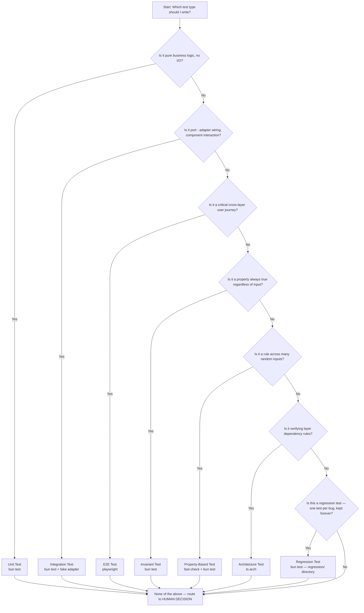
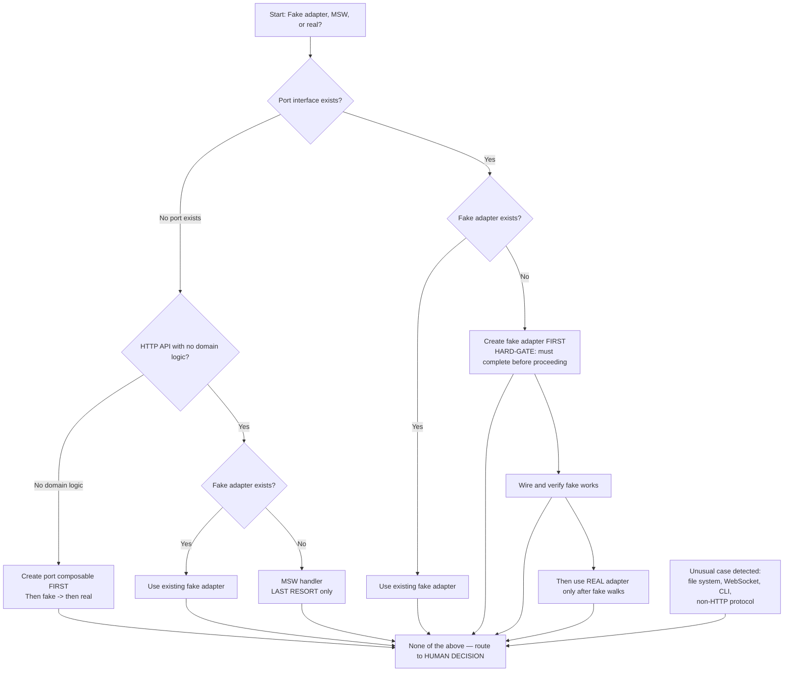
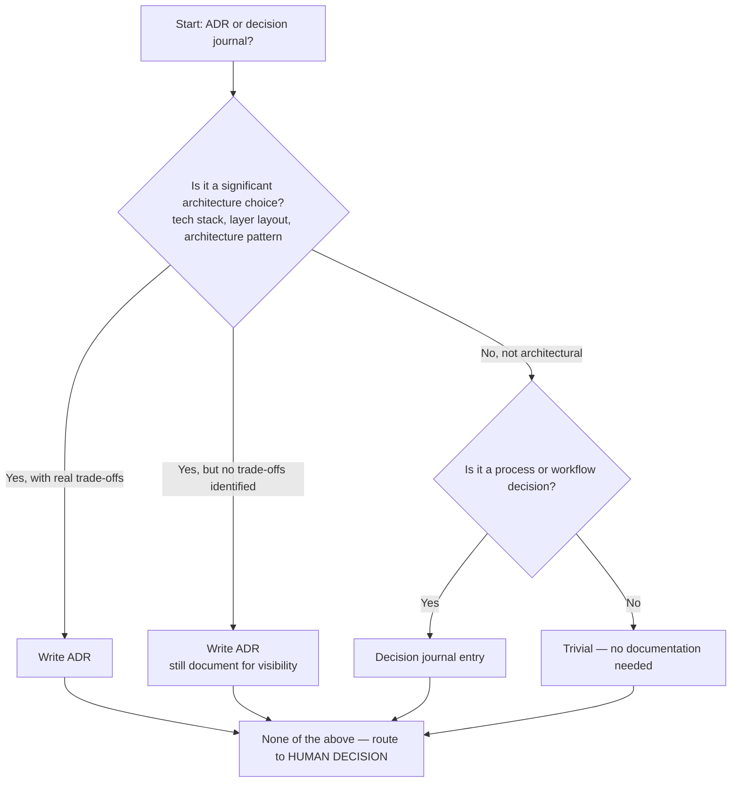
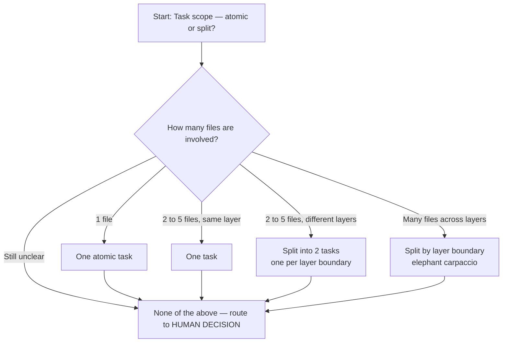
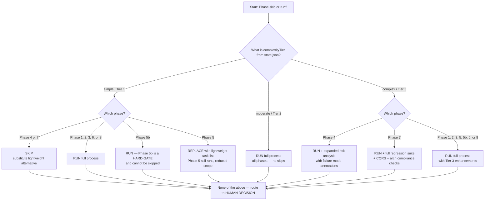

# Decision Trees

**Usage:** Reference these flowcharts when making routine decisions during development. Each tree includes an explicit fallback to human judgment for edge cases not covered by the branches.

---

## Tree 1: Which test type should I write?

**Summary:** Business logic -> Unit. Wiring -> Integration. Critical journeys -> E2E. Invariants -> Invariant test. Random-input rules -> Property-based. Layer rules -> Architecture test. Bug fix regression -> Regression test. Anything else -> human.

---

## Tree 2: Fake adapter, MSW, or real?

**Note:** Fallback for unusual cases: If the dependency doesn't fit any branch above — e.g., a file system, CLI tool, WebSocket, or non-HTTP protocol — do NOT force it into the tree. Route directly to a human decision.

**Summary:** Port exists + fake exists -> fake. Port exists + no fake -> create fake first (hard gate), wire, verify, then real only after fake passes. No port + HTTP + no domain logic -> fake if exists, otherwise MSW (last resort). No port + no domain -> create port first. Any unusual case -> human immediately.

---

## Tree 3: ADR or decision journal entry?

**Summary:** Architectural with trade-offs -> ADR. Architectural without trade-offs -> still ADR. Process/workflow -> decision journal. Trivial -> skip. Anything else -> human.

---

## Tree 4: Task scope — atomic or split?

**Summary:** 1 file -> atomic. 2-5 files same layer -> one task. 2-5 files different layers -> split by layer. Many files across layers -> split by layer (carpaccio). Unclear -> human.

---

## Tree 5: Phase skip or run?

**Summary:**
- **Tier 1 (simple)**: Phase 4 or 7 → skip (lightweight alternative). Phase 5 → replace with lightweight task list (still runs). Phase 5b → always run (HARD-GATE). Tier 1 phases 1, 2, 3, 6, 8 → run.
- **Tier 2 (moderate)**: all phases run — no skips.
- **Tier 3 (complex)**: Phase 4 → run + expanded risk analysis. Phase 7 → run + full regression suite + CQRS + architecture compliance. All other phases → run with enhancements. Any mismatch → human decision.

---

*Last updated: 2026-03-28*
