# Feature-Sliced Design (FSD) Reference

> FSD layer hierarchy and import rules adapted for Nuxt Layers architecture.

## Layer Hierarchy

The 6-layer hierarchy enforces strict import direction. Code can only import from layers at the same level or below.

```
app → pages → widgets → features → entities → shared
```

| Layer | Contains | Can Import | NOT Allowed to Import |
|-------|----------|------------|----------------------|
| **app** | Root configuration, plugins, middleware | pages, widgets, features, entities, shared | Nothing above it |
| **pages** | Page components, route layouts | widgets, features, entities, shared | app |
| **widgets** | Composite UI components (assembled from entities/features) | features, entities, shared | app, pages |
| **features** | User actions, use cases, business logic | entities, shared | app, pages, widgets |
| **entities** | Domain objects, business entities | shared | app, pages, widgets, features |
| **shared** | UI primitives, utilities, types | Nothing (pure utilities) | entities, features, widgets, pages, app |

**Key Rule:** `shared` can be imported anywhere, but nothing can import into `shared` from higher layers.

---

## Nuxt Layers as FSD Implementation

FSD concepts map directly onto Nuxt Layers directory structure:

| FSD Layer | Nuxt Layers Location | Purpose |
|-----------|---------------------|---------|
| **app** | `app/` (root) | System entry, plugins, middleware, composables |
| **pages** | `pages/` | Route-level page components |
| **widgets** | `layers/{domain}/components/` + `layers/{domain}/widgets/` | Composite UI blocks |
| **features** | `layers/{domain}/composables/` | Feature composables (use* naming) |
| **entities** | `layers/{domain}/components/` | Entity components (domain objects) |
| **shared** | `layers/base/` | Shared utilities, UI primitives, types |

### Directory Structure Mapping

```
.
├── app/                          # app layer
│   ├── plugins/
│   ├── middleware/
│   └── composables/
├── pages/                        # pages layer
├── layers/
│   ├── base/                    # shared layer
│   │   ├── components/          # UI primitives
│   │   ├── utils/               # pure utilities
│   │   └── types/
│   └── {domain}/                # domain layer (entities + features)
│       ├── components/          # entities (domain components)
│       ├── composables/         # features (use* composables)
│       └── adapters/           # external integrations
```

---

## Segment Types

Each layer can contain segments that organize code by technical concern:

| Segment | Contents | Belongs To |
|---------|----------|------------|
| **ui/** | Presentational components | entities, widgets, shared |
| **api/** | API client code, endpoints, request/response types | features |
| **model/** | Business logic, state management, stores | entities, features |
| **lib/** | Third-party library wrappers, integrations | shared, features |
| **config/** | Configuration objects, constants | all layers |
| **index.ts** | Public API re-export for the layer/segment | all layers |

### Segment Usage Example

```
layers/
└── orders/
    ├── components/           # entity: OrderCard, OrderList
    │   ├── ui/               # OrderCard.vue
    │   └── model/            # orderStore.ts
    ├── composables/           # features: useCreateOrder, useCancelOrder
    │   ├── api/              # orderApi.ts
    │   └── useCreateOrder.ts
    └── adapters/             # adapters: paymentGateway, shippingApi
```

---

## Cross-Layer References

### Within Same Layer

Entities within the same layer CAN reference each other:

```
entities/
├── UserCard.vue       # can import OrderList.vue
└── OrderList.vue      # can import UserCard.vue
```

### Across Layers (Downward Only)

Imports MUST flow downward in the hierarchy:

```
✓ features/orders/ → entities/user/     # feature uses entity
✓ widgets/CartSummary → features/checkout  # widget uses feature
✗ entities/user/ → features/orders/     # FORBIDDEN
✗ features/orders/ → widgets/CartSummary  # FORBIDDEN
```

### The @x Notation for Cross-Entity Imports

Use `@x/` alias to clearly mark cross-entity boundaries. **Always point to the domain's `index.ts`** — never to deep paths:

```typescript
// In layers/orders/composables/useCheckout.ts
import { UserCard } from '@x/users/components'  // Entity component from users layer
import { useUser } from '@x/users'             // Public composable from users layer

export const useCheckout = () => {
  // ...
}
```

```typescript
// nuxt.config.ts
// @x/ always points to the domain's index.ts — the public boundary
export default defineNuxtConfig({
  alias: {
    '@x/users': 'layers/users/index.ts',
    '@x/orders': 'layers/orders/index.ts',
    '@x/auth': 'layers/auth/index.ts',
    '@x/base': 'layers/base/index.ts',
  }
})
```

---

## Feature vs Entity Decision

Use this flowchart to determine whether code belongs in `entities/` or `features/`:

```mermaid
flowchart TD
    A[Start] --> B{Is it a noun<br/>&#40;domain object&#41;?}
    B -->|Yes| E[Entity]
    B -->|No| C{Is it a user action<br/>or use case?}
    C -->|Yes| F[Feature]
    C -->|No| D{Is it a pure UI primitive<br/>&#40;button, input, card&#41;?}
    D -->|Yes| G[Shared]
    D -->|No| H[Re-evaluate]

    style E fill:#4CAF50,color:#fff
    style F fill:#2196F3,color:#fff
    style G fill:#9E9E9E,color:#fff
```



### Decision Examples

| Thing | Decision | Reason |
|-------|----------|--------|
| `UserCard`, `OrderList`, `ProductCard` | Entity | Domain object (noun) |
| `useLogin`, `useCheckout`, `useCreateOrder` | Feature | User action (verb) |
| `BaseButton`, `BaseInput`, `BaseModal` | Shared | Pure UI primitive |
| `useFetchProducts` with API logic | Feature | Contains business logic + API |
| `productApi.ts` | Feature/api/ | API calls belong in feature segment |

---

## File Naming Conventions

| Layer | Naming | Example |
|-------|--------|---------|
| **entities** | PascalCase | `UserCard.vue`, `OrderList.vue`, `ProductCard.vue` |
| **features** | camelCase composable + kebab-case component | `useLogin.ts`, `login-form.vue` |
| **widgets** | PascalCase | `CartSummary.vue`, `CheckoutWidget.vue` |
| **shared** | PascalCase (components) / camelCase (utils) | `BaseButton.vue`, `formatDate.ts` |
| **pages** | kebab-case | `checkout.vue`, `order-confirmation.vue` |
| **config** | kebab-case | `api-config.ts`, `feature-flags.ts` |

---

## Common Violations and Fixes

| Violation | Problem | Fix |
|-----------|---------|-----|
| **entities/ imports features/** | Entity depends on business logic | Move logic to a composable in features/, call from entity |
| **shared/ imports entities/** | Shared becomes coupled to domain | Extract only pure UI primitive to shared/ui/ |
| **features/ has raw API calls** | Mixed concerns in feature | Create `features/{name}/api/` segment for API calls |
| **No index.ts exports** | Internal structure exposed, brittle imports | Always re-export public API via index.ts |
| **Everything in widgets/** | Widgets become God objects | Move pure/presentational components to shared/ui/ |

### Example Fix: Entity Importing Feature

```typescript
// BEFORE: entities/OrderCard.vue (VIOLATION)
import { useFormatCurrency } from '~/features/pricing'

// AFTER: Move concern appropriately
// entities/OrderCard.vue
import { formatCurrency } from '@x/base/utils'

// OR if formatting is domain-specific business logic:
// features/pricing/composables/useFormatCurrency.ts
export const useFormatCurrency = () => {
  const formatCurrency = (amount: number) => {
    // domain-specific formatting logic
  }
  return { formatCurrency }
}
```

---

## Integration with Ports & Adapters

FSD and Ports & Adapters address different architectural concerns and compose together:

### Concern Separation

| Pattern | Addresses | Question Answered |
|---------|-----------|-------------------|
| **FSD** | UI layer separation | What imports what? |
| **Ports** | External dependencies | What's behind the import? |
| **Adapters** | Concrete implementations | How does it actually work? |

### How They Compose

```
UI Layer (FSD)
    │
    │ imports through port interface
    ▼
Port Interface (in features/ or entities/)
    │
    │ implemented by
    ▼
Adapter (in layers/{domain}/adapters/)
    │
    │ implements
    ▼
External System (API, DB, third-party)
```

### Rule: Ports in Domain, Adapters in Infrastructure

- **Ports** live in `features/` or `entities/` (domain layer)
- **Adapters** live in `layers/{domain}/adapters/`
- **UI never imports adapters directly**

```typescript
// layers/auth/ports/AuthPort.ts
export interface AuthPort {
  login(credentials: Credentials): Promise<User>
  logout(): Promise<void>
}

// layers/auth/composables/useAuth.ts
import type { AuthPort } from '../ports/AuthPort'
import { authAdapter } from '~/app/diComposition'  // from composition root

export const useAuth = () => {
  // adapter comes from DI composition root — never imported from adapters/
}
```

---

## C4 Integration

FSD layers map to C4 component types for consistent architecture documentation:

| FSD Layer | C4 Component Type | Description |
|-----------|-------------------|-------------|
| **app** | Container (System Entry) | Application entry point, main configuration |
| **pages** | Container or Component | Page-level components, route boundaries |
| **widgets** | Component (Composite UI) | Composite UI blocks assembling entities/features |
| **features** | Component (Business Logic) | Use cases, business rules, application services |
| **entities** | Component (Domain Primitive) | Domain objects, business entities |
| **shared** | Component (Infrastructure/Utilities) | Cross-cutting concerns, UI primitives |

### Consistency Note

> Document import rules in `docs/architecture/03-components.md` so the C4 model and FSD structure remain consistent. When updating FSD layers,同步 update the C4 component documentation.

### C4 Boundaries vs FSD Layers

```
┌─────────────────────────────────────────────────────┐
│                   C4: System                        │
│  ┌───────────────────────────────────────────────┐  │
│  │  C4: Container (app layer)                   │  │
│  │  ┌─────────────────────────────────────────┐   │  │
│  │  │  pages/  (C4: Container/Component)      │   │  │
│  │  │  ┌─────────────────────────────────┐    │   │  │
│  │  │  │  widgets/ (C4: Component)      │    │   │  │
│  │  │  │  ┌───────────┐ ┌────────────┐   │    │   │  │
│  │  │  │  │ features/ │ │ entities/  │   │    │   │  │
│  │  │  │  │ (C4: Comp)│ │ (C4: Comp) │   │    │   │  │
│  │  │  │  └───────────┘ └────────────┘   │    │   │  │
│  │  │  └─────────────────────────────────┘    │   │  │
│  │  └─────────────────────────────────────────┘   │  │
│  │  ┌─────────────────────────────────────────┐   │  │
│  │  │  shared/ (C4: Component - Infrastructure)│  │  │
│  │  └─────────────────────────────────────────┘   │  │
│  └───────────────────────────────────────────────┘  │
└─────────────────────────────────────────────────────┘
```

---

## Quick Reference

### Import Direction

```
app ─────► pages ─────► widgets ─────► features ─────► entities ─────► shared
                                                                    ▲
                                                                    │
                                                    shared can be imported anywhere
```

### Key File Locations

| FSD Concept | Nuxt Implementation |
|-------------|---------------------|
| Entity UI | `layers/{domain}/components/{EntityName}.vue` |
| Feature Composable | `layers/{domain}/composables/use{Feature}.ts` |
| Feature API | `layers/{domain}/composables/api/` |
| Shared UI Primitive | `layers/base/components/` |
| Shared Utility | `layers/base/utils/` |
| Port Interface | `layers/{domain}/ports/{Name}Port.ts` |
| Public API | `layers/{domain}/index.ts` |
| Adapter | `layers/{domain}/adapters/` |
| Composition Root | `app/diComposition.ts` |

### Remember

1. **Downward imports only** — never import from layers above
2. **Use @x/ for cross-entity imports** — makes boundaries explicit
3. **Ports before adapters** — define interface in domain, implement in adapters
4. **index.ts for public API** — always re-export for stable imports
5. **Feature = verb, Entity = noun** — use this for placement decisions
