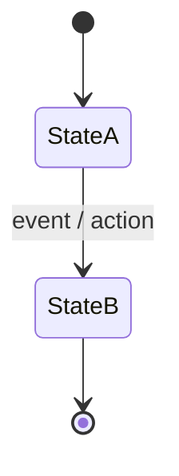
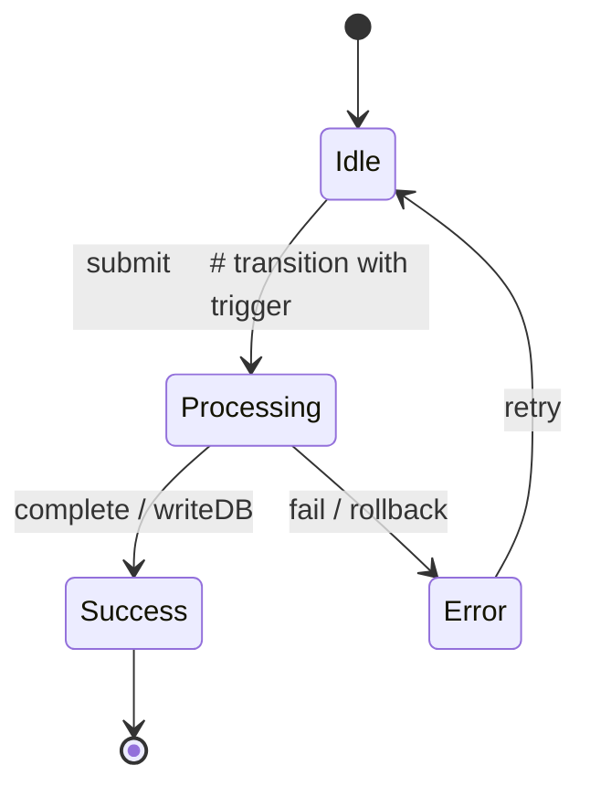
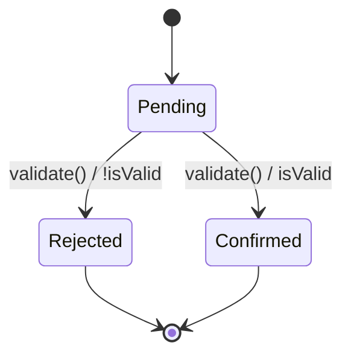
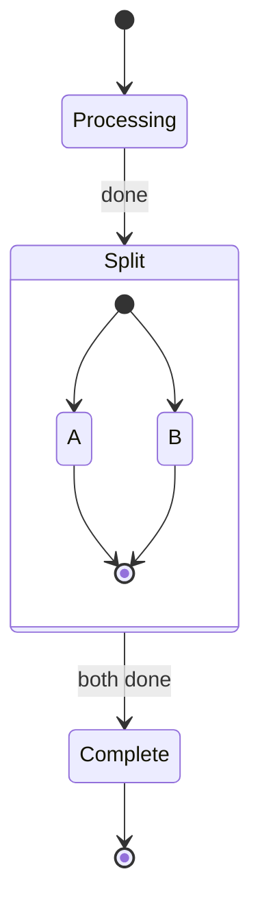
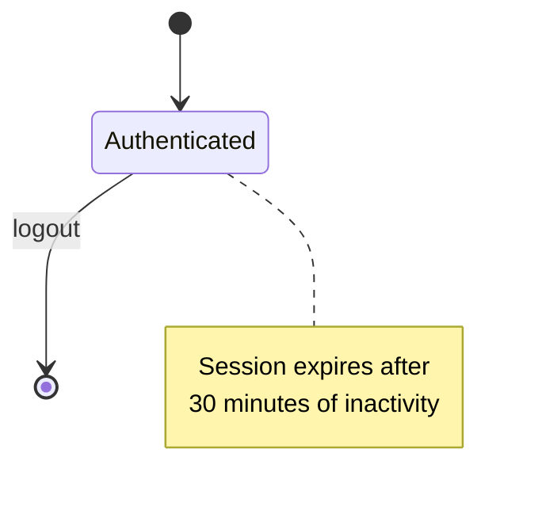
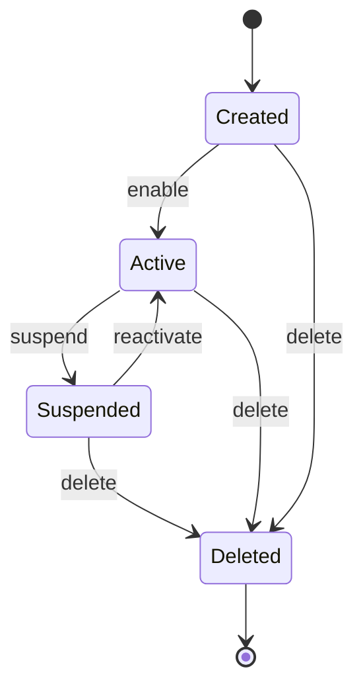
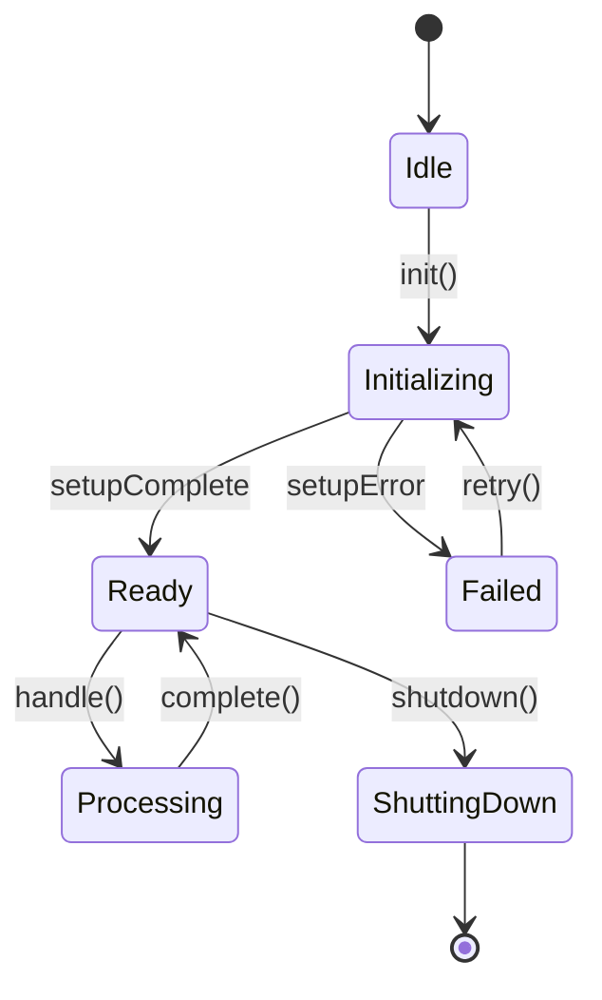
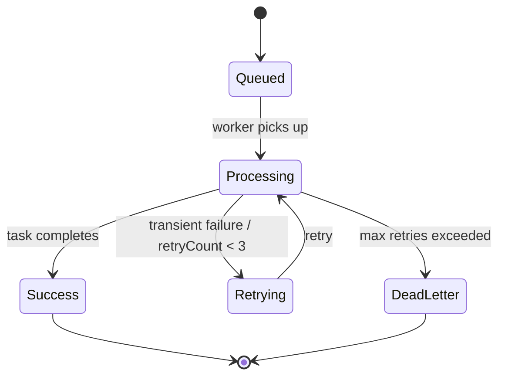

# State Diagrams — Mermaid

## When to Use

Use a **Mermaid stateDiagram** when a component or domain entity has meaningful state with transitions that are complex enough to benefit from visual representation.

**Good candidates:**
- Entities with distinct states: `Order.pending → Order.processing → Order.shipped → Order.delivered`
- Services with internal state machines: `AuthService.idle → AuthService.validating → AuthService.authenticated → AuthService.error`
- Workflows with stages and transitions: `Onboarding.start → Onboarding.profile → Onboarding.verify → Onboarding.complete`

**Not needed:**
- Simple boolean flags (e.g., `isActive: true/false`)
- CRUD entities where state is just database persistence
- Components with no meaningful internal state

## Syntax



### Key Elements



### Guards (Conditional Transitions)



### Fork and Join



### Notes



## Common Patterns

### Pattern 1: Entity Lifecycle



### Pattern 2: Service State Machine



### Pattern 3: Async Workflow



## Placement

State diagrams go in `.dev-flow/architecture/states/` with one file per domain/component:

```
.dev-flow/architecture/
├── states/
│   ├── order-entity.states.md
│   ├── auth-service.states.md
│   └── task-workflow.states.md
└── sequences/
    ├── checkout-flow.md
    └── auth-flow.md
```

Reference them from `docs/architecture/04-key-flows.md` or the relevant domain section.

## Verification

When implementing, compare the actual state transitions in code against the diagram:
- Every `[*] --> State` must have a corresponding initialization path
- Every transition `A --> B` must be implementable (guards must be testable)
- Final states `State --> [*]` must be reachable

If a transition in the diagram cannot be implemented, the diagram is wrong — fix the diagram first.
