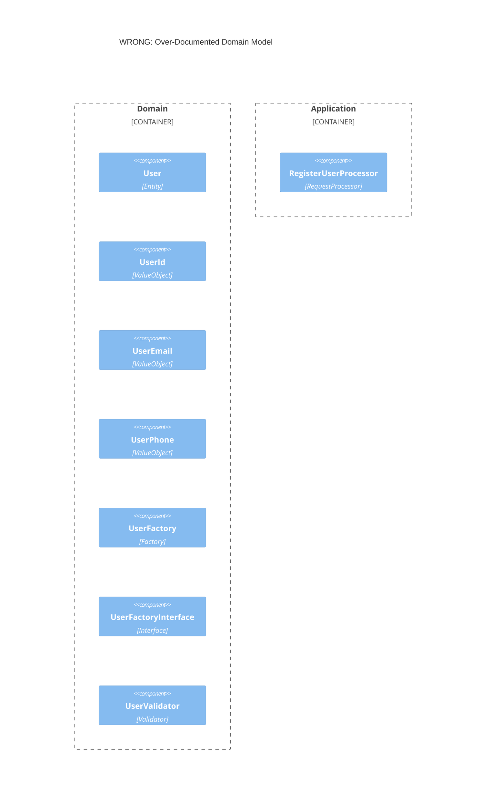
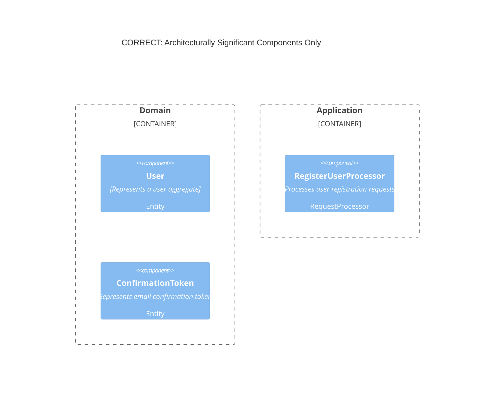
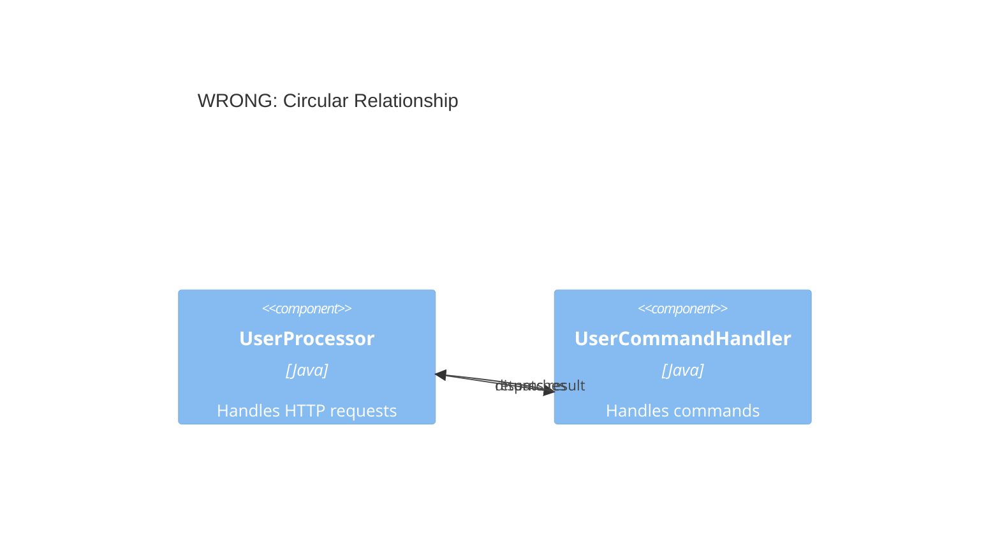
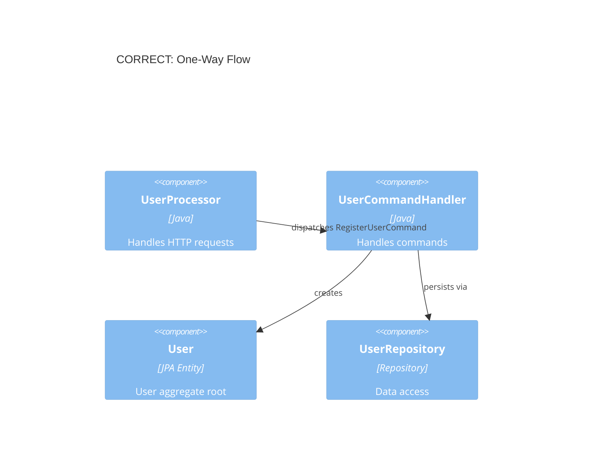
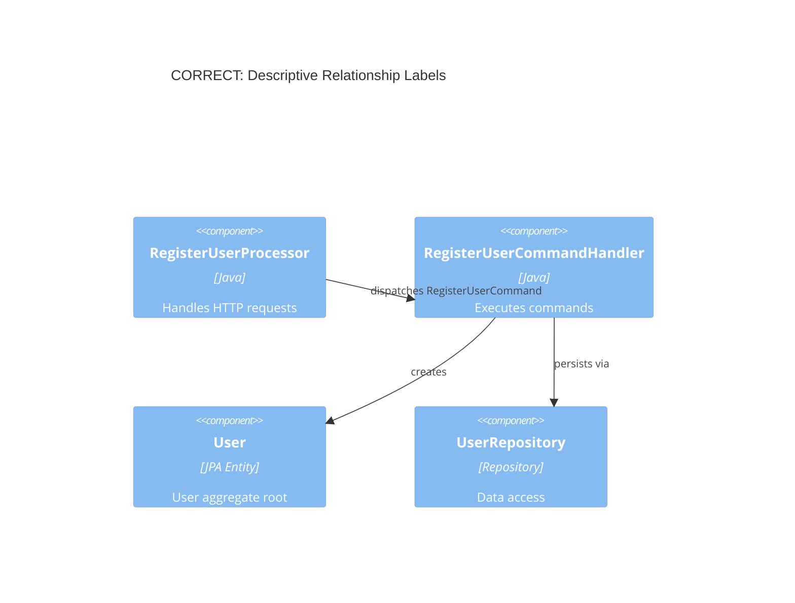
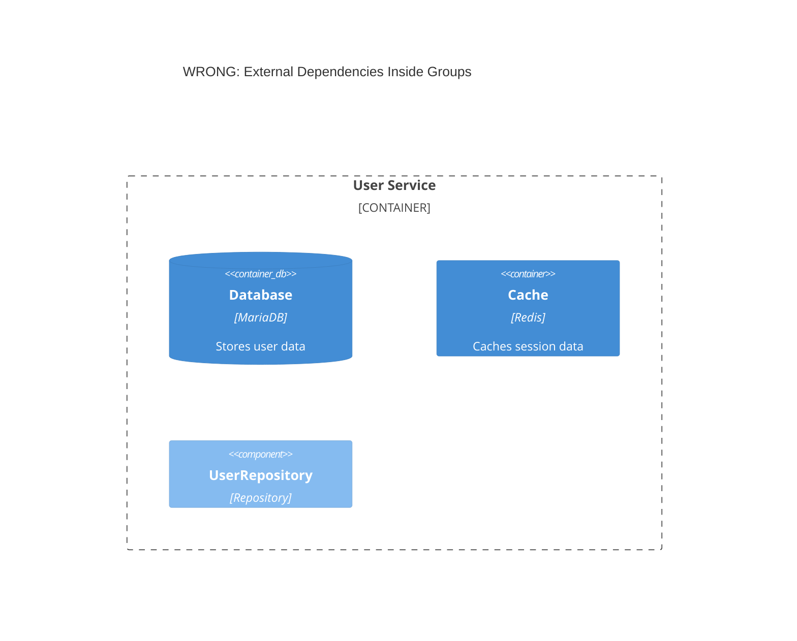
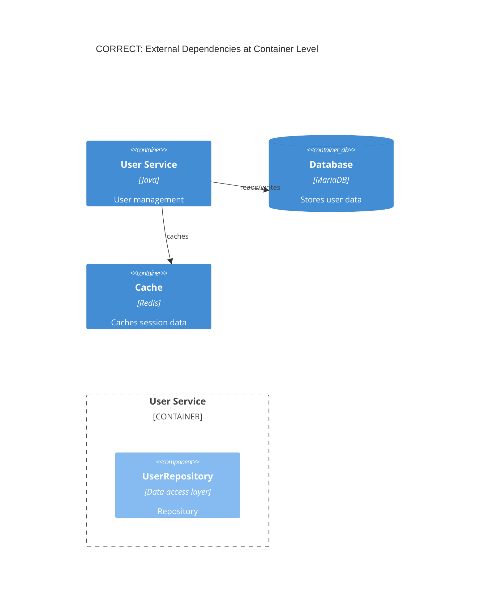
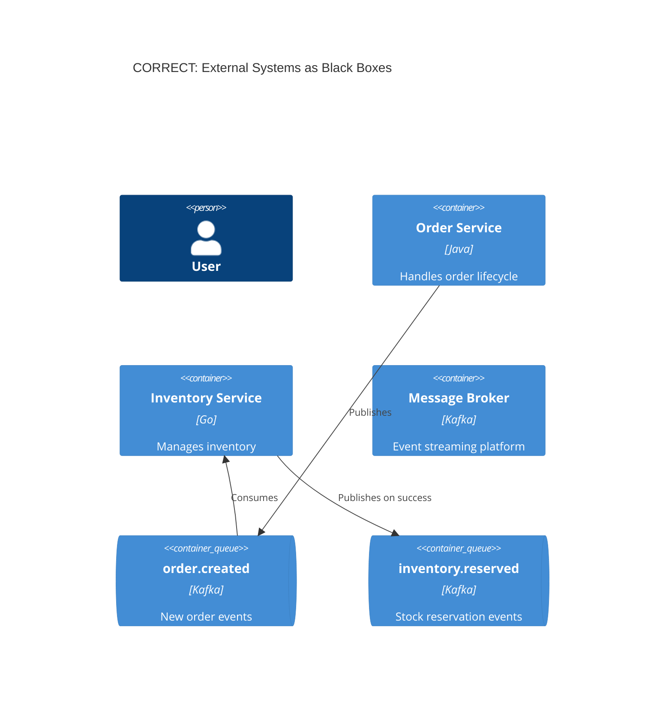
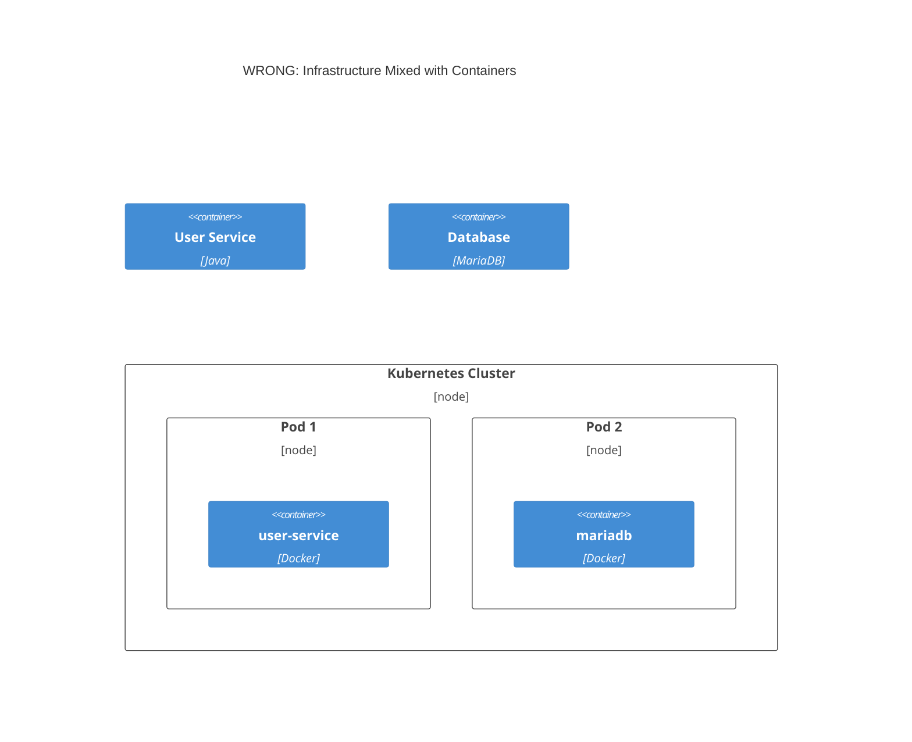
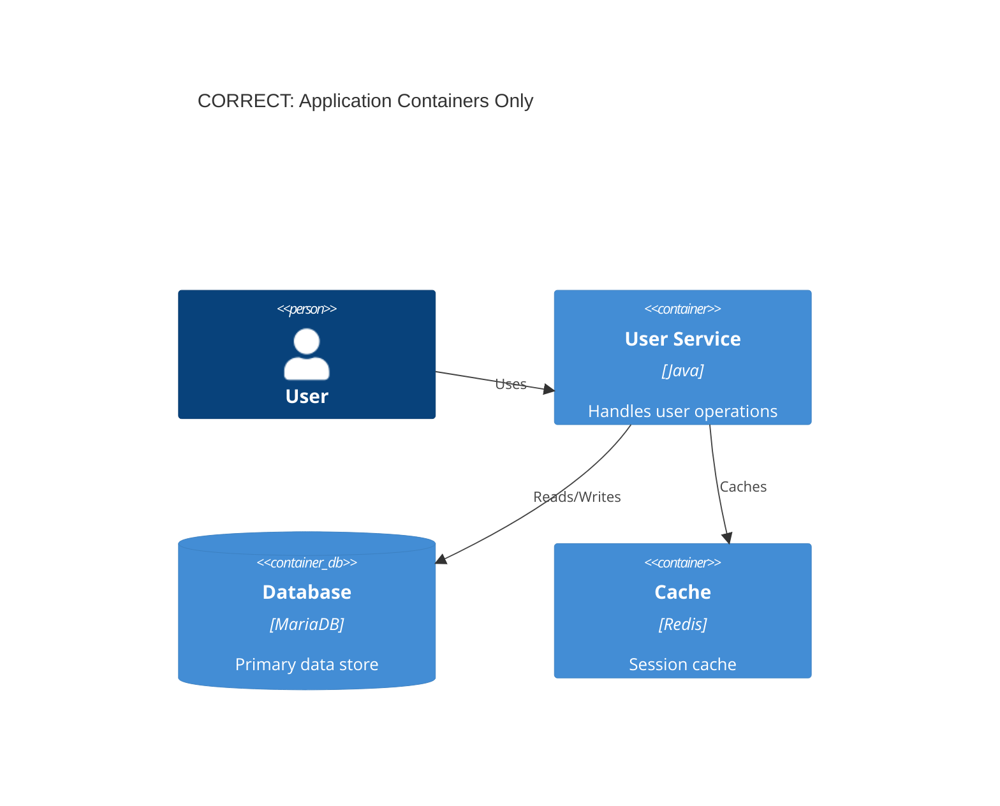

# C4 Common Mistakes

> Agent-required reading before creating C4 diagrams. These anti-patterns cause confusion, errors, or maintenance burdens — and each has a clear correct alternative.

---

## 1. Abstraction Level

### 1.1 Over-Documenting Internal Implementation

**The Problem:** Including every class in a diagram (value objects, factories, interfaces, DTOs, validators) drowns the architecture in noise. C4 diagrams should show **architecturally significant** components, not the full class inventory.

**Wrong:**


**Correct:**


**Why it matters:** Cluttered diagrams obscure the architecture newcomers need to understand. Focus on 15–25 components per diagram — the rest are implementation details.

---

## 2. Relationships

### 2.1 Circular Dependencies

**The Problem:** A → B → A relationships indicate a design problem and make diagrams hard to follow.

**Wrong:**


**Correct:**


**Why it matters:** Circular dependencies violate hexagonal architecture principles and make event-driven flows impossible to reason about.

---

### 2.2 Unlabeled Relationships

**The Problem:** Arrows without descriptions leave the reader guessing what data or control flow actually occurs.

**Wrong:**
```mermaid
C4Component
  title WRONG: Unlabeled Relationships
  Component(registerUserProcessor, "RegisterUserProcessor", "Java")
  Component(registerUserCommandHandler, "RegisterUserCommandHandler", "Java")
  Component(user, "User", "JPA Entity")
  Rel(registerUserProcessor, registerUserCommandHandler)
  Rel(registerUserCommandHandler, user)
```

**Correct:**


**Why it matters:** Relationship labels are the primary mechanism for communicating data flow intent — without them, diagrams are ambiguous.

---

## 3. External Systems

### 3.1 External Dependencies Outside Groups

**The Problem:** Databases, caches, and message brokers are external systems — they should not be placed inside application groups. This blurs the boundary between your code and the infrastructure your service depends on.

**Wrong:**


**Correct:**


**Why it matters:** Placing external dependencies outside groups makes it immediately visible that they are **not** part of your codebase — they are shared infrastructure.

---

### 3.2 Showing Internals of External Systems

**The Problem:** Modeling the internal structure of third-party services (e.g., Kafka topics, Kafka connectors, consumer groups) inside a container diagram leaks implementation details that don't belong at this level of abstraction.

**Wrong:**
```mermaid
C4Container
  title WRONG: External System Internals Exposed
  Container(orderService, "Order Service", "Java")
  Container(inventoryService, "Inventory Service", "Go")
  Container(kafka, "Kafka", "Event Streaming")
  Container_Boundary(kafka_internals, "Kafka Internals") {
    Container(topic, "order.created", "Topic")
    Container(connector, "DB Connector", "Debezium")
    Container(consumerGroup, "Consumer Group", "Kafka Consumers")
  }
  Rel(orderService, kafka_internals.topic, "Publishes")
  Rel(kafka_internals.connector, inventoryService, "Streams")
```

**Correct:**


**Why it matters:** C4 abstracts away implementation detail. Showing a broker's internal topics as separate containers is correct — treating Kafka itself as a monolithic box is the mistake.

---

## 4. Diagram Scope

### 4.1 Filtered Views Causing "Element Does Not Exist" Errors

**The Problem:** Using `include ->component->` filtered syntax is fragile — if the component name changes or the include pattern is wrong, the DSL fails with "element does not exist" at the referenced line. Single comprehensive views are clearer and more maintainable.

**Wrong:**
```dsl
views {
    component softwareSystem.serviceName "Components_User" {
        include ->user->
        include ->userStatus->
        include ->userType->
        autolayout lr
    }
}
```
*Error: `workspace.dsl: The element "user" does not exist at line 242`*

**Correct:**
```dsl
views {
    component softwareSystem.serviceName "Components_All" {
        include *
    }
}
```
*All components render. No name-matching required.*

**Why it matters:** Filtered includes introduce fragile name coupling between the DSL and the component definitions — a rename silently breaks the view.

---

## 5. Deployment

### 5.1 Infrastructure in Container Diagrams

**The Problem:** Mixing infrastructure nodes (servers, Kubernetes pods, Docker containers) with application containers violates the C4 abstraction. Container diagrams show **application components**, not deployment topology.

**Wrong:**


**Correct:**

*Deployment topology belongs in deployment diagrams, not container diagrams.*

**Why it matters:** Container diagrams answer "what are the applications?" — deployment diagrams answer "where do they run?" Mixing them causes confusion at both levels.

---

## 6. Styling

### 6.1 Code-Style Comments

**The Problem:** Inline `//` or `#` comments clutter the DSL and are redundant when component descriptions are well-written. The user-service pattern uses zero comments — descriptions should be self-documenting.

**Wrong:**
```dsl
group "Application" {
    // User Processors - These handle HTTP requests
    registerUserProcessor = component "RegisterUserProcessor" "..." {
        tags "Item"
    }
    // This one handles PATCH for partial updates
    userPatchProcessor = component "UserPatchProcessor" "..." {
        tags "Item"
    }
    // Full replacement with PUT
    userPutProcessor = component "UserPutProcessor" "..." {
        tags "Item"
    }
}
```

**Correct:**
```dsl
group "Application" {
    registerUserProcessor = component "RegisterUserProcessor" "Processes HTTP requests for user registration" "RequestProcessor" {
        tags "Item"
    }
    userPatchProcessor = component "UserPatchProcessor" "Processes HTTP PATCH requests for partial user updates" "RequestProcessor" {
        tags "Item"
    }
    userPutProcessor = component "UserPutProcessor" "Processes HTTP PUT requests for full user replacement" "RequestProcessor" {
        tags "Item"
    }
}
```

**Why it matters:** Comments rot over time and are often not maintained. Descriptive component names and descriptions are self-documenting and survive refactoring.

---

### 6.2 Missing Component Type Labels

**The Problem:** Without a type label (the third parameter), readers cannot distinguish a `RequestProcessor` from a `Repository` or a `DomainEvent` at a glance. Type labels are the primary visual cue for component role.

**Wrong:**
```dsl
registerUserProcessor = component "RegisterUserProcessor" "Processes HTTP requests" {
    tags "Item"
}
```

**Correct:**
```dsl
registerUserProcessor = component "RegisterUserProcessor" "Processes HTTP requests for user registration" "RequestProcessor" {
    tags "Item"
}
```

**Why it matters:** Type labels allow readers to instantly understand the role of each component without reading its full description — essential for large diagrams.

---

## 7. DSL Syntax

### 7.1 Using `autolayout` Directive

**The Problem:** The `autolayout` directive produces hard-to-read diagrams because the layout algorithm has no understanding of architectural proximity. The resulting positions bear no relationship to how the system actually works.

**Wrong:**
```dsl
views {
    component softwareSystem.serviceName "Components_All" {
        include *
        autolayout lr 150 150
    }
}
```
*Produces an arbitrary arrangement that obscures architectural groupings.*

**Correct:**
```dsl
views {
    component softwareSystem.serviceName "Components_All" {
        include *
    }
}
```
*Leave `autolayout` out entirely. Position components manually in the Structurizr UI, then click "Save workspace" to persist positions to `workspace.json`.*

**Why it matters:** Automatic layout algorithms cannot represent architectural intent. Manual positioning in the UI preserves the diagram author's understanding of component proximity.

---

### 7.2 Forgetting to Commit `workspace.json`

**The Problem:** Committing only `workspace.dsl` after repositioning components in the Structurizr UI loses all manual layout. The next person to check out the workspace sees the default auto-arranged diagram.

**Wrong:**
```bash
git add workspace.dsl
git commit -m "Update architecture"
```
*Result: Diagram resets to auto-layout. All manual positioning is lost.*

**Correct:**
```bash
git add workspace.dsl workspace.json
git commit -m "feat: update architecture with new processor"
```
*Both files committed. Layout is preserved for the entire team.*

**Why it matters:** `workspace.json` is generated by the Structurizr UI when you save — it stores all manual positions, element styles, and view configuration. Without it, every team member starts from a broken layout.

---

## 8. Naming

### 8.1 Inconsistent Component Naming

**The Problem:** Mixing naming conventions (camelCase variables, snake_case aliases, abbreviated names) makes it impossible to predict component names and makes refactoring risky.

**Wrong:**
```dsl
group "Application" {
    createProc = component "RegisterUserProcessor" "..." {
        tags "Item"
    }
    handler1 = component "UpdateUserCommandHandler" "..." {
        tags "Item"
    }
}

group "Infrastructure" {
    mysql_user_repo = component "DoctrineUserRepository" "..." {
        tags "Item"
    }
}
```

**Correct:**
```dsl
group "Application" {
    registerUserProcessor = component "RegisterUserProcessor" "Processes user registration requests" "RequestProcessor" {
        tags "Item"
    }
    updateUserCommandHandler = component "UpdateUserCommandHandler" "Handles user update commands" "CommandHandler" {
        tags "Item"
    }
}

group "Infrastructure" {
    doctrineUserRepository = component "DoctrineUserRepository" "Data access for user aggregates" "Repository" {
        tags "Item"
    }
}
```

**Why it matters:** Variable names should mirror class names in camelCase. This makes it trivial to find a component in the DSL when you know its class name, and vice versa.

---

## Quick Checklist

Before submitting a C4 diagram for review:

- [ ] 15–25 components per diagram (not 40+)
- [ ] One-way relationships only (no circular flows)
- [ ] All relationships have descriptive labels
- [ ] External dependencies (database, cache, broker) are at container level, outside groups
- [ ] Single view uses `include *` — no filtered `->component->` includes
- [ ] Infrastructure nodes (servers, pods, containers) are not in container diagrams
- [ ] No code-style `//` comments in DSL
- [ ] Every component has a type label (third parameter)
- [ ] No `autolayout` directive
- [ ] Both `workspace.dsl` and `workspace.json` are committed
- [ ] Component variable names match class names in camelCase
- [ ] Descriptions are self-documenting (no inline comments needed)

---

## Related Documentation

- [`references/c4-documentation.md`](../references/c4-documentation.md) — DSL and workspace setup
- [`references/c4-dynamic.md`](../references/c4-dynamic.md) — Dynamic interaction diagrams
- [`why/c4-event-driven.md`](./c4-event-driven.md) — Event-driven patterns in C4
