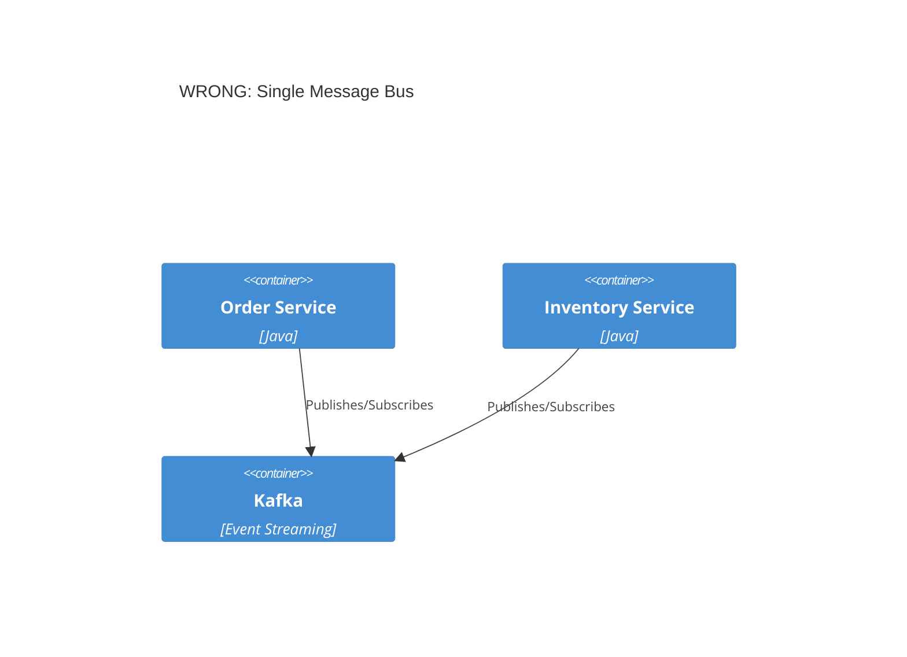
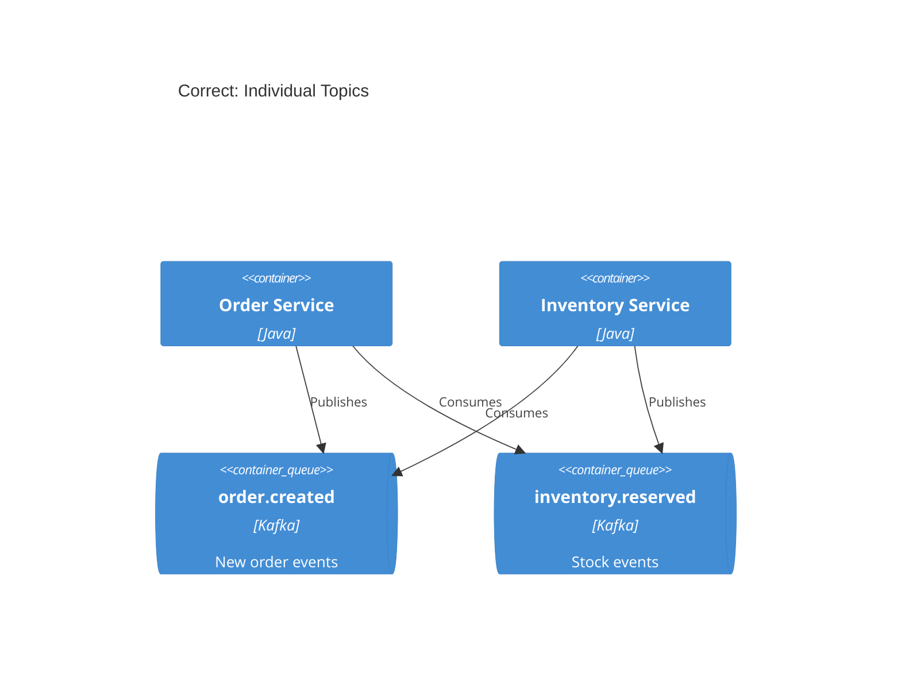
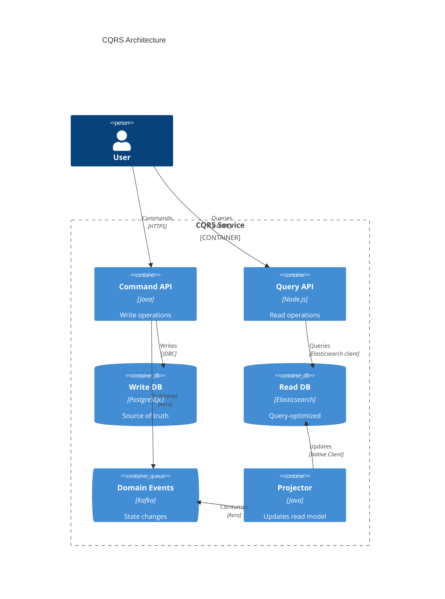
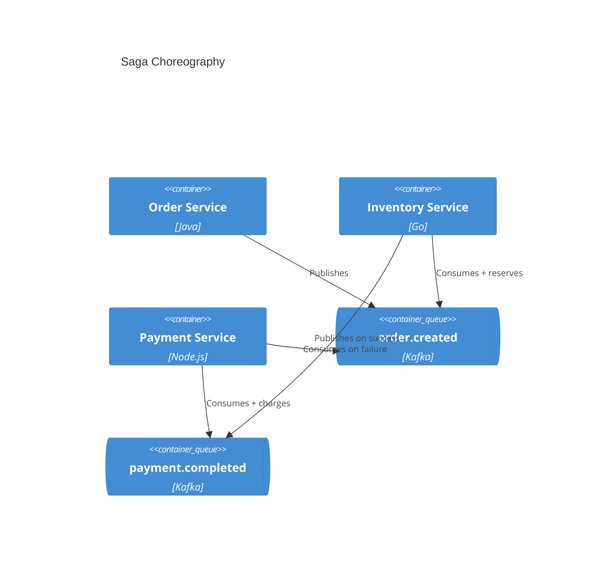
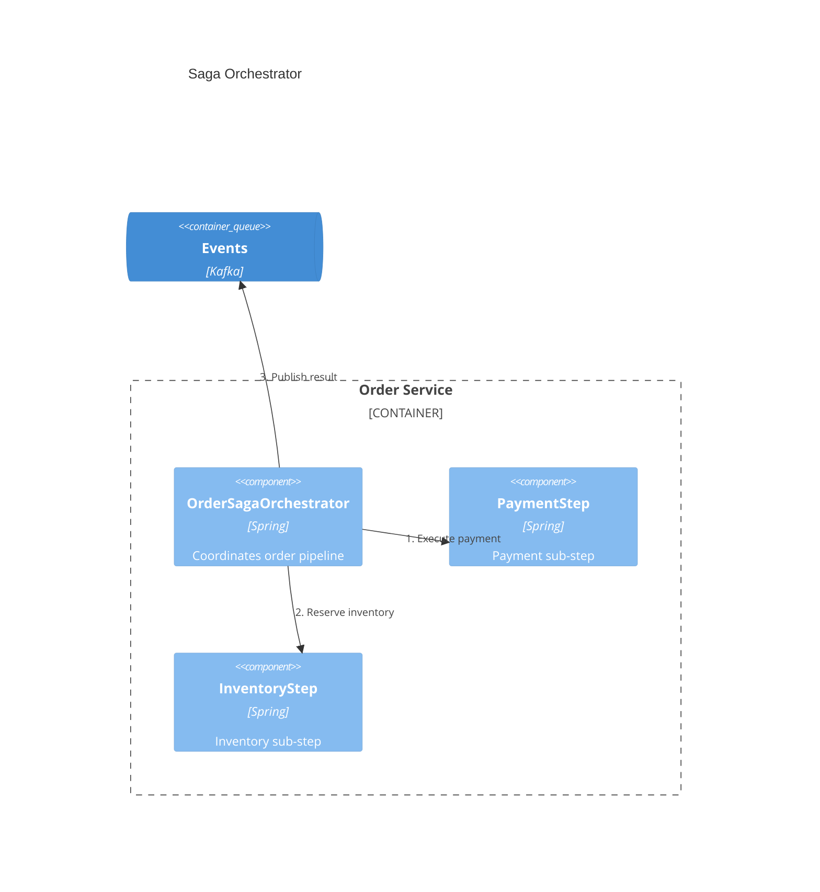
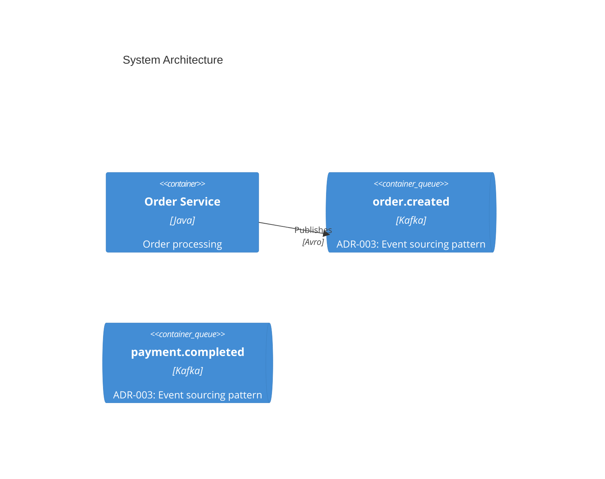

# Event-Driven C4 Patterns

## Core Principle

**Show individual topics/queues as separate containers.** Never show a single "Kafka" or "RabbitMQ" box with all services connecting to it. This hides actual data flow.

## Pattern 1: Individual Topics as Containers

### Wrong — Single Message Bus



### Correct — Individual Topics



## Pattern 2: CQRS Container View

Show command side and query side as separate container regions:



## Pattern 3: Saga Choreography vs Orchestration

### Choreography (events only)

Events trigger subscribers, no central orchestrator:



### Orchestration (central saga)

One component coordinates the entire saga:



## ADR Integration

For each event-driven pattern, note in the component description which ADR covers the decision.

ADR references go on infrastructure components (queues, databases, external services) and key architectural decisions. Format: `ADR-NNN: Short title`.

### Before/After Example

**Before (no ADR reference):**
```
Component(orderCreated, "order.created", "Kafka", "Order events")
```

**After (with ADR reference):**
```
Component(orderCreated, "order.created", "Kafka", "ADR-003: Event sourcing pattern")
```

### Full Example


