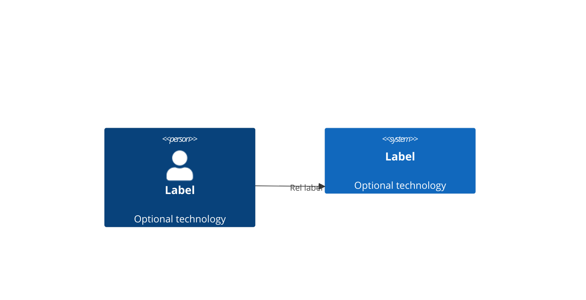
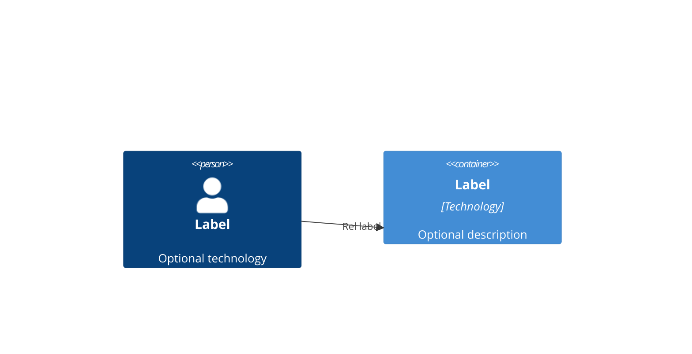

# dev-flow Plugin Enhancement v2.0.1 → v2.1.0 — Implementation Plan

> **For agentic workers:** Use superpowers:subagent-driven-development to implement this plan. Steps use checkbox (`- [ ]`) syntax for tracking.

**Goal:** Implement all 20 named enhancements to the dev-flow plugin, producing v2.1.0.

**Architecture:** This is a plugin-internal enhancement — all changes live in `dev-flow/.claude-plugin/`. Changes are surgical: fix Python gate scripts, add new gates, update phase markdown files, create reference docs, and wire the lessons system. No architectural restructuring.

**Tech Stack:** Python 3 (gates), Markdown (phases, agents, references), JSON (state.json), Bash (gate invocations).

**Plugin root:** `C:\Users\ivana\OneDrive\Desktop\AI\AI-APPLICATIONS\dev-flow\.claude-plugin`

**Test strategy:** No unit tests for plugin files. Verification is manual: gate scripts are tested by running them against the plugin directory, phase files are verified by reading the modified content, reference docs are verified by checking they render correctly.

---

## Chunk 1: Phase 1 — Gate Infrastructure

**CR-1: Python cross-platform fixes, CR-2: Path alignment, DC-2: lessons.md format validation**

This chunk fixes the foundation. CR-1 makes gates runnable on Windows. CR-2 aligns all path references. DC-2 adds format validation to the Phase 5b gate.

---

### Task 1: Fix CR-1 — Python shebang and emoji in gate_phase0.py

**Files:**
- Modify: `gates/gate_phase0.py`

- [ ] **Step 1: Fix shebang and emoji**

Edit `gates/gate_phase0.py`:
```python
# OLD (line 1):
#!/usr/bin/env python3

# NEW:
#!/usr/bin/env python
```

Edit the symbol mapping in `main()`:
```python
# OLD:
symbol = "✅" if c["status"] == "pass" else "❌"

# NEW:
symbol = "[PASS]" if c["status"] == "pass" else "[FAIL]"
```

- [ ] **Step 2: Verify the file looks correct**

Run: `head -1 gates/gate_phase0.py`
Expected: `#!/usr/bin/env python`

Run: `grep -c "\[PASS\]\|\[FAIL\]" gates/gate_phase0.py`
Expected: `2`

- [ ] **Step 3: Commit**

```bash
git add gates/gate_phase0.py
git commit -m "fix(gates): CR-1 python shebang and ASCII symbols in gate_phase0"
```

---

### Task 2: Fix CR-1 — Python shebang and emoji in gate_phase5b.py

**Files:**
- Modify: `gates/gate_phase5b.py`

- [ ] **Step 1: Fix shebang and emoji**

Edit `gates/gate_phase5b.py`:
```python
# OLD (line 1):
#!/usr/bin/env python3

# NEW:
#!/usr/bin/env python
```

Edit the symbol mapping in `main()`:
```python
# OLD:
symbol = {"pass": "✅", "fail": "❌", "skip": "⏭️"}[c["status"]]

# NEW:
symbol = {"pass": "[PASS]", "fail": "[FAIL]", "skip": "[SKIP]"}[c["status"]]
```

- [ ] **Step 2: Verify**

Run: `head -1 gates/gate_phase5b.py`
Expected: `#!/usr/bin/env python`

Run: `grep -c "\[PASS\]\|\[FAIL\]\|\[SKIP\]" gates/gate_phase5b.py`
Expected: `2` (symbol mapping + _json_output call)

- [ ] **Step 3: Commit**

```bash
git add gates/gate_phase5b.py
git commit -m "fix(gates): CR-1 python shebang and ASCII symbols in gate_phase5b"
```

---

### Task 3: Fix CR-1 — Python shebang and emoji in gate_phase6_start.py

**Files:**
- Modify: `gates/gate_phase6_start.py`

- [ ] **Step 1: Fix shebang and emoji**

Edit `gates/gate_phase6_start.py`:
```python
# OLD (line 1):
#!/usr/bin/env python3

# NEW:
#!/usr/bin/env python
```

Edit the symbol mapping in `main()`:
```python
# OLD:
symbol = {"pass": "✅", "fail": "❌", "skip": "⏭️"}[c["status"]]

# NEW:
symbol = {"pass": "[PASS]", "fail": "[FAIL]", "skip": "[SKIP]"}[c["status"]]
```

- [ ] **Step 2: Verify**

Run: `head -1 gates/gate_phase6_start.py`
Expected: `#!/usr/bin/env python`

Run: `grep -c "\[PASS\]\|\[FAIL\]\|\[SKIP\]" gates/gate_phase6_start.py`
Expected: `2`

- [ ] **Step 3: Commit**

```bash
git add gates/gate_phase6_start.py
git commit -m "fix(gates): CR-1 python shebang and ASCII symbols in gate_phase6_start"
```

---

### Task 4: Fix CR-1 — Python shebang and emoji in gate_phase6_end.py

**Files:**
- Modify: `gates/gate_phase6_end.py`

- [ ] **Step 1: Fix shebang and emoji**

Edit `gates/gate_phase6_end.py`:
```python
# OLD (line 1):
#!/usr/bin/env python3

# NEW:
#!/usr/bin/env python
```

Edit the symbol mapping in `main()`:
```python
# OLD:
symbol = {"pass": "✅", "fail": "❌", "skip": "⏭️"}[c["status"]]

# NEW:
symbol = {"pass": "[PASS]", "fail": "[FAIL]", "skip": "[SKIP]"}[c["status"]]
```

- [ ] **Step 2: Verify**

Run: `head -1 gates/gate_phase6_end.py`
Expected: `#!/usr/bin/env python`

Run: `grep -c "\[PASS\]\|\[FAIL\]\|\[SKIP\]" gates/gate_phase6_end.py`
Expected: `2`

- [ ] **Step 3: Commit**

```bash
git add gates/gate_phase6_end.py
git commit -m "fix(gates): CR-1 python shebang and ASCII symbols in gate_phase6_end"
```

---

### Task 5: Fix CR-1 — PYTHONIOENCODING in _json_output.py

**Files:**
- Modify: `gates/_json_output.py`

- [ ] **Step 1: Add encoding note comment**

Edit `gates/_json_output.py` — add a comment at the top:
```python
#!/usr/bin/env python
"""Shared JSON output utility for gate scripts.

Ensure gates are run with PYTHONIOENCODING=utf-8 on Windows
to prevent UnicodeEncodeError when printing ASCII check symbols.
"""
```

- [ ] **Step 2: Verify**

Run: `grep -c "PYTHONIOENCODING" gates/_json_output.py`
Expected: `1`

- [ ] **Step 3: Commit**

```bash
git add gates/_json_output.py
git commit -m "fix(gates): CR-1 add encoding guidance comment to _json_output"
```

---

### Task 6: Fix CR-2 — Update path in gate_phase5b.py

**Files:**
- Modify: `gates/gate_phase5b.py`

- [ ] **Step 1: Change PLANS_DIR**

Edit `gates/gate_phase5b.py`:
```python
# OLD:
PLANS_DIR = PROJECT_ROOT / "docs" / "superpowers" / "plans"

# NEW:
PLANS_DIR = PROJECT_ROOT / ".dev-flow" / "plans"
```

- [ ] **Step 2: Verify**

Run: `grep "PLANS_DIR" gates/gate_phase5b.py`
Expected: `PLANS_DIR = PROJECT_ROOT / ".dev-flow" / "plans"`

- [ ] **Step 3: Commit**

```bash
git add gates/gate_phase5b.py
git commit -m "fix(gates): CR-2 align PLANS_DIR to .dev-flow/plans in gate_phase5b"
```

---

### Task 7: Fix CR-2 — Update path in gate_phase6_start.py

**Files:**
- Modify: `gates/gate_phase6_start.py`

- [ ] **Step 1: Change PLANS_DIR**

Edit `gates/gate_phase6_start.py`:
```python
# OLD:
PLANS_DIR = PROJECT_ROOT / "docs" / "superpowers" / "plans"

# NEW:
PLANS_DIR = PROJECT_ROOT / ".dev-flow" / "plans"
```

- [ ] **Step 2: Verify**

Run: `grep "PLANS_DIR" gates/gate_phase6_start.py`
Expected: `PLANS_DIR = PROJECT_ROOT / ".dev-flow" / "plans"`

- [ ] **Step 3: Commit**

```bash
git add gates/gate_phase6_start.py
git commit -m "fix(gates): CR-2 align PLANS_DIR to .dev-flow/plans in gate_phase6_start"
```

---

### Task 8: Fix CR-2 — Update python3→python in phase file invocations

**Files:**
- Modify: `phases/05b-preimplementation-gate.md`
- Modify: `phases/06-implementation.md`

- [ ] **Step 1: Update 05b-preimplementation-gate.md**

In `phases/05b-preimplementation-gate.md`, find and update:
```markdown
# OLD:
Run: `python3 ${CLAUDE_PLUGIN_ROOT}/gates/gate_phase5b.py`

# NEW:
Run: `PYTHONIOENCODING=utf-8 python ${CLAUDE_PLUGIN_ROOT}/gates/gate_phase5b.py`
```

Also update the Fix Loop sections:
```markdown
# OLD:
Run: `python3 ${CLAUDE_PLUGIN_ROOT}/gates/gate_phase5b.py`

# NEW:
Run: `PYTHONIOENCODING=utf-8 python ${CLAUDE_PLUGIN_ROOT}/gates/gate_phase5b.py`
```

- [ ] **Step 2: Update 06-implementation.md**

Find all `python3` gate invocations in `phases/06-implementation.md` and replace with:
```
PYTHONIOENCODING=utf-8 python
```

Specifically update these lines:
- `Run: \`python3 ${CLAUDE_PLUGIN_ROOT}/gates/gate_phase6_start.py\``
- `Run: \`python3 ${CLAUDE_PLUGIN_ROOT}/gates/gate_phase6_end.py\``

- [ ] **Step 3: Verify**

Run: `grep -c "python3.*gate" phases/05b-preimplementation-gate.md phases/06-implementation.md`
Expected: `0` (all gate invocations should use `python` now)

Run: `grep -c "PYTHONIOENCODING=utf-8 python.*gate" phases/05b-preimplementation-gate.md phases/06-implementation.md`
Expected: `4` (gate_phase5b x2, gate_phase6_start x1, gate_phase6_end x1)

- [ ] **Step 4: Commit**

```bash
git add phases/05b-preimplementation-gate.md phases/06-implementation.md
git commit -m "fix(phases): CR-1 CR-2 update gate invocations to use python + PYTHONIOENCODING"
```

---

### Task 9: Fix CR-2 — Update spec-reviewer agent path reference

**Files:**
- Modify: `agents/spec-reviewer.md`

- [ ] **Step 1: Update path reference**

In `agents/spec-reviewer.md`, find the reference to `docs/superpowers/specs/` and update:
```markdown
# OLD:
Read the design spec at `docs/superpowers/specs/` (matching the plan being executed)

# NEW:
Read the design spec at `.dev-flow/design/` (matching the plan being executed)
```

- [ ] **Step 2: Verify**

Run: `grep "docs/superpowers" agents/spec-reviewer.md`
Expected: (no output — should be empty)

Run: `grep ".dev-flow/design" agents/spec-reviewer.md`
Expected: (should show the updated path)

- [ ] **Step 3: Commit**

```bash
git add agents/spec-reviewer.md
git commit -m "fix(agents): CR-2 align design spec path to .dev-flow/design in spec-reviewer"
```

---

### Task 10: Fix CR-2 — Update Phase 6 plan path references

**Files:**
- Modify: `phases/06-implementation.md`

- [ ] **Step 1: Update plan path references**

In `phases/06-implementation.md`, find all references to `docs/superpowers/plans/` and update:
```markdown
# OLD:
Read the implementation plan from `docs/superpowers/plans/`

# NEW:
Read the implementation plan from `.dev-flow/plans/`
```

- [ ] **Step 2: Verify**

Run: `grep "docs/superpowers/plans" phases/06-implementation.md`
Expected: (no output)

Run: `grep ".dev-flow/plans" phases/06-implementation.md`
Expected: (should show updated path)

- [ ] **Step 3: Commit**

```bash
git add phases/06-implementation.md
git commit -m "fix(phases): CR-2 align plan path to .dev-flow/plans in Phase 6"
```

---

### Task 11: DC-2 — Add lessons.md format validation to gate_phase5b.py

**Files:**
- Modify: `gates/gate_phase5b.py`

- [ ] **Step 1: Add LESSONS_PATH constant and check_lessons_format function**

After the existing imports and before `def find_latest_plan()`, add:

```python
LESSONS_PATH = PROJECT_ROOT / ".dev-flow" / "lessons.md"

def check_lessons_format() -> dict:
    """Soft warn if lessons.md missing; hard fail if exists but malformed."""
    if not LESSONS_PATH.exists():
        return {
            "check": "lessons_format",
            "status": "warn",
            "message": "lessons: .dev-flow/lessons.md not found (soft warn — may be created during workflow)",
            "fix": "File will be created when first gap is encountered. No action needed now.",
            "missing": [],
        }
    content = LESSONS_PATH.read_text()
    if not content.strip():
        return {
            "check": "lessons_format",
            "status": "fail",
            "message": "lessons: .dev-flow/lessons.md is empty",
            "fix": "Create .dev-flow/lessons.md with a header: '# Lessons Log\n\nAppend only. Never edit existing entries.\n\n---\n'",
            "missing": [],
        }
    # Check each entry has required fields
    entries = content.split('## ')
    malformed = []
    for entry in entries[1:]:  # skip header
        lines = entry.split('\n')
        header = lines[0].strip() if lines else ""
        body = '\n'.join(lines[1:]) if len(lines) > 1 else ""
        has_error = "**Error:**" in body
        has_fix = "**Fix:**" in body
        if header and not (has_error and has_fix):
            malformed.append(header[:60])
    if malformed:
        return {
            "check": "lessons_format",
            "status": "fail",
            "message": f"lessons: {len(malformed)} malformed entry/entries (missing **Error:** or **Fix:**)",
            "fix": "Fix entries in .dev-flow/lessons.md — each entry needs **Error:** and **Fix:** fields",
            "missing": malformed,
        }
    return {
        "check": "lessons_format",
        "status": "pass",
        "message": "lessons: format OK",
        "fix": "",
        "missing": [],
    }
```

- [ ] **Step 2: Add check_lessons_format to main() checks list**

Edit the `main()` function in `gates/gate_phase5b.py`:
```python
# OLD:
    checks = [
        check_plan_exists(),
        check_lint_config(),
        check_ports_defined(),
        check_fake_adapters(),
        check_deferred_decisions_clean(),
    ]

# NEW:
    checks = [
        check_plan_exists(),
        check_lint_config(),
        check_ports_defined(),
        check_fake_adapters(),
        check_deferred_decisions_clean(),
        check_lessons_format(),
    ]
```

Also update the symbol mapping to handle "warn" status:
```python
# OLD:
symbol = {"pass": "[PASS]", "fail": "[FAIL]", "skip": "[SKIP]"}[c["status"]]

# NEW:
symbol = {"pass": "[PASS]", "fail": "[FAIL]", "skip": "[SKIP]", "warn": "[WARN]"}[c["status"]]
```

- [ ] **Step 3: Verify**

Run: `grep "check_lessons_format" gates/gate_phase5b.py`
Expected: `check_lessons_format(),`

Run: `python gates/gate_phase5b.py` in the plugin directory
Expected: Should print `[PASS]` or `[WARN]` for lessons (plugin has no `.dev-flow/lessons.md` so soft warn expected)

- [ ] **Step 4: Commit**

```bash
git add gates/gate_phase5b.py
git commit -m "feat(gate): DC-2 add lessons.md format validation to gate_phase5b"
```

---

## Chunk 2: Phase 2 — Phase 6 Quality Enforcement

**CR-3: New gate_phase6_evidence.py, HI-1: Spec/quality reviews non-optional, HI-3: Wired column, HI-4: E2E count**

---

### Task 12: CR-3 — Create gate_phase6_evidence.py

**Files:**
- Create: `gates/gate_phase6_evidence.py`

- [ ] **Step 1: Create the gate script**

Create `gates/gate_phase6_evidence.py`:

```python
#!/usr/bin/env python
"""Gate Phase 6 Evidence: Verify implementation evidence exists before Phase 7.

Checks mechanical evidence: test files, ADR files, workspace.dsl, Mermaid C4,
slice wiring status, test suite passes, no skipped tests.
PYTHONIOENCODING=utf-8 must be set when running this script on Windows.
"""

import sys
import pathlib
import re
import subprocess

PROJECT_ROOT = pathlib.Path.cwd()
PLANS_DIR = PROJECT_ROOT / ".dev-flow" / "plans"
DOCS_DIR = PROJECT_ROOT / "docs"
C4_DIR = PROJECT_ROOT / ".dev-flow" / "architecture" / "c4"
STATE_PATH = PROJECT_ROOT / ".dev-flow" / "state.json"
TEMPLATES_DIR = PROJECT_ROOT / ".claude-plugin" / "templates" if (PROJECT_ROOT / ".claude-plugin").exists() else PROJECT_ROOT / "templates"

sys.path.insert(0, str(pathlib.Path(__file__).parent))
from _json_output import gate_exit


def find_latest_plan() -> pathlib.Path | None:
    if not PLANS_DIR.exists():
        return None
    plan_files = [f for f in PLANS_DIR.glob("*.md") if "premortem" not in f.stem.lower()]
    if not plan_files:
        return None
    return max(plan_files, key=lambda f: f.stat().st_mtime)

PLAN_PATH = find_latest_plan()


def scan_test_files() -> dict:
    """At least one test file matching **/*.test.ts or **/*.spec.ts must exist."""
    test_patterns = list(PROJECT_ROOT.glob("**/*.test.ts")) + list(PROJECT_ROOT.glob("**/*.spec.ts"))
    test_files = [f for f in test_patterns if "node_modules" not in str(f)]
    if not test_files:
        return {
            "check": "test_files",
            "status": "fail",
            "message": "test files: no .test.ts or .spec.ts files found",
            "fix": "Run Phase 6 implementation — at least one test file must exist",
            "missing": [],
        }
    return {
        "check": "test_files",
        "status": "pass",
        "message": f"test files: OK ({len(test_files)} file(s) found)",
        "fix": "",
        "missing": [],
    }


def scan_e2e_tests() -> dict:
    """E2E test count must match what the plan promised."""
    if PLAN_PATH is None:
        return {"check": "e2e_test_count", "status": "skip", "message": "plan not found — skipping E2E count check", "fix": "", "missing": []}
    content = PLAN_PATH.read_text()
    # Find "N E2E tests" pattern in plan
    e2e_match = re.search(r'(\d+)\s+E2E\s+test', content, re.IGNORECASE)
    if not e2e_match:
        return {"check": "e2e_test_count", "status": "skip", "message": "E2E tests: count not specified in plan", "fix": "", "missing": []}
    planned_count = int(e2e_match.group(1))
    # Discover actual E2E test files
    e2e_patterns = list(PROJECT_ROOT.glob("**/*.e2e.ts"))
    if "tests" in str(PROJECT_ROOT):
        e2e_patterns += list((PROJECT_ROOT / "tests").glob("**/*.test.ts"))
    actual_files = [f for f in e2e_patterns if "node_modules" not in str(f)]
    actual_count = len(actual_files)
    if actual_count < planned_count:
        return {
            "check": "e2e_test_count",
            "status": "fail",
            "message": f"E2E tests: plan promised {planned_count}, found {actual_count}",
            "fix": f"Expected {planned_count} E2E test files, found {actual_count}. Check plan's test strategy section.",
            "missing": [f"{planned_count - actual_count} missing E2E test file(s)"],
        }
    return {
        "check": "e2e_test_count",
        "status": "pass",
        "message": f"E2E tests: {actual_count} found (plan promised {planned_count})",
        "fix": "",
        "missing": [],
    }


def scan_adr_files() -> dict:
    """At least one ADR file must exist in docs/decisions/."""
    if not DOCS_DIR.exists():
        return {"check": "adr_files", "status": "fail", "message": "docs/decisions/: docs/ directory not found", "fix": "Create docs/decisions/ directory and add ADR files", "missing": []}
    decisions_dir = DOCS_DIR / "decisions"
    if not decisions_dir.exists():
        return {"check": "adr_files", "status": "fail", "message": "docs/decisions/: directory not found", "fix": "Create docs/decisions/ and add ADR files", "missing": []}
    adr_files = list(decisions_dir.glob("*.md"))
    if not adr_files:
        return {
            "check": "adr_files",
            "status": "fail",
            "message": "docs/decisions/: no ADR files found",
            "fix": "Create at least one ADR file in docs/decisions/ (e.g., 0001-approach-selection.md)",
            "missing": ["no ADR files"],
        }
    return {
        "check": "adr_files",
        "status": "pass",
        "message": f"ADR files: OK ({len(adr_files)} file(s) in docs/decisions/)",
        "fix": "",
        "missing": [],
    }


def check_workspace_dsl() -> dict:
    """docs/workspace.dsl must exist and be non-empty."""
    dsl_path = DOCS_DIR / "workspace.dsl"
    if not dsl_path.exists():
        return {
            "check": "workspace_dsl",
            "status": "fail",
            "message": "docs/workspace.dsl: not found",
            "fix": "Run Phase 3 to create docs/workspace.dsl",
            "missing": [],
        }
    if dsl_path.stat().st_size == 0:
        return {
            "check": "workspace_dsl",
            "status": "fail",
            "message": "docs/workspace.dsl: file is empty",
            "fix": "Populate docs/workspace.dsl with C4 model and views",
            "missing": [],
        }
    return {
        "check": "workspace_dsl",
        "status": "pass",
        "message": "docs/workspace.dsl: OK",
        "fix": "",
        "missing": [],
    }


def check_c4_mmd() -> dict:
    """.dev-flow/architecture/c4/ must have at least one .mmd file."""
    if not C4_DIR.exists():
        return {
            "check": "c4_mmd",
            "status": "fail",
            "message": ".dev-flow/architecture/c4/: directory not found",
            "fix": "Run Phase 3 to generate Mermaid C4 diagrams in .dev-flow/architecture/c4/",
            "missing": [],
        }
    mmd_files = list(C4_DIR.glob("*.mmd"))
    if not mmd_files:
        return {
            "check": "c4_mmd",
            "status": "fail",
            "message": ".dev-flow/architecture/c4/: no .mmd files found",
            "fix": "Generate Mermaid C4 diagrams in .dev-flow/architecture/c4/ (ST-1)",
            "missing": [],
        }
    return {
        "check": "c4_mmd",
        "status": "pass",
        "message": f"Mermaid C4: OK ({len(mmd_files)} .mmd file(s))",
        "fix": "",
        "missing": [],
    }


def check_slice_wiring() -> dict:
    """All slices with Status=complete must have Wired=yes."""
    if PLAN_PATH is None:
        return {"check": "slice_tracking", "status": "skip", "message": "plan not found — skipping slice wiring check", "fix": "", "missing": []}
    content = PLAN_PATH.read_text()
    # Find task rows with Status=complete but no Wired=yes
    # Pattern: | Task N | description | pending/scaffolded/complete | yes/no |
    rows = re.findall(r'\|\s*(\d+(?:\.\d+)?)\s*\|[^|]*\|[^|]*\|\s*(complete)\s*\|[^|]*\|\s*(no)\s*\|', content, re.IGNORECASE)
    if rows:
        task_ids = [r[0] for r in rows]
        return {
            "check": "slice_tracking",
            "status": "fail",
            "message": f"slice tracking: task(s) {', '.join(task_ids)} marked complete but Wired=no",
            "fix": "Set Wired=yes for all complete tasks, or downgrade Status to scaffolded",
            "missing": task_ids,
        }
    return {
        "check": "slice_tracking",
        "status": "pass",
        "message": "slice tracking: all complete tasks have Wired=yes",
        "fix": "",
        "missing": [],
    }


def check_test_suite_passes() -> dict:
    """bun test must exit 0."""
    try:
        result = subprocess.run(["bun", "test"], capture_output=True, text=True, timeout=120, cwd=PROJECT_ROOT)
        if result.returncode == 0:
            return {"check": "test_suite_passes", "status": "pass", "message": "test suite: all tests pass", "fix": "", "missing": []}
        return {
            "check": "test_suite_passes",
            "status": "fail",
            "message": f"test suite: FAILED (exit {result.returncode})\n{result.stdout[-500:]}{result.stderr[-500:]}",
            "fix": "Run 'bun test' in project root to see failures, fix before Phase 7",
            "missing": [],
        }
    except FileNotFoundError:
        return {"check": "test_suite_passes", "status": "skip", "message": "test suite: bun not found — skipping", "fix": "", "missing": []}
    except subprocess.TimeoutExpired:
        return {"check": "test_suite_passes", "status": "fail", "message": "test suite: timed out after 120s", "fix": "Run 'bun test' manually to diagnose", "missing": []}


def check_no_skipped_tests() -> dict:
    """No test.skip = true should be present."""
    test_files = list(PROJECT_ROOT.glob("**/*.test.ts")) + list(PROJECT_ROOT.glob("**/*.spec.ts"))
    skipped = []
    for f in test_files:
        if "node_modules" in str(f):
            continue
        content = f.read_text()
        if re.search(r'test\.skip\s*=\s*true', content):
            skipped.append(str(f.relative_to(PROJECT_ROOT)))
    if skipped:
        return {
            "check": "no_skipped_tests",
            "status": "fail",
            "message": f"skipped tests: {len(skipped)} file(s) with test.skip=true",
            "fix": "Remove test.skip=true or convert to test() with pending assertion",
            "missing": skipped,
        }
    return {"check": "no_skipped_tests", "status": "pass", "message": "skipped tests: none found", "fix": "", "missing": []}


def main() -> int:
    print("=== Gate Phase 6 Evidence ===\n")
    checks = [
        scan_test_files(),
        scan_e2e_tests(),
        scan_adr_files(),
        check_workspace_dsl(),
        check_c4_mmd(),
        check_slice_wiring(),
        check_test_suite_passes(),
        check_no_skipped_tests(),
    ]
    for c in checks:
        symbol = {"pass": "[PASS]", "fail": "[FAIL]", "skip": "[SKIP]", "warn": "[WARN]"}[c["status"]]
        print(f"{symbol} {c['message']}")
    return gate_exit("phase6_evidence", checks)

if __name__ == "__main__":
    sys.exit(main())
```

- [ ] **Step 2: Verify the file was created and has correct shebang**

Run: `head -1 gates/gate_phase6_evidence.py`
Expected: `#!/usr/bin/env python`

Run: `python gates/gate_phase6_evidence.py` (from the todo-app project root, where all the project files exist)
Expected: Should run and show `[PASS]` or `[SKIP]` for each check

- [ ] **Step 3: Commit**

```bash
git add gates/gate_phase6_evidence.py
git commit -m "feat(gate): CR-3 create gate_phase6_evidence.py"
```

---

### Task 13: HI-1 — Make spec and quality reviews non-optional in Phase 6

**Files:**
- Modify: `phases/06-implementation.md`

- [ ] **Step 1: Add HARD-GATE enforcement note to the review steps**

In `phases/06-implementation.md`, locate the section "4. Spec Compliance Review" and add a header note:

```markdown
### 4. Spec Compliance Review

**<HARD-GATE — Non-optional>**
The spec review CANNOT be skipped, bypassed, or short-circuited.
If the reviewer returns NOT COMPLIANT → implementer receives specific non-compliant items → fixes → re-verify → re-review.
Loop until COMPLIANT. Do NOT proceed to quality review until spec reviewer says COMPLIANT.
```

And locate "5. Code Quality Review" and add:

```markdown
### 5. Code Quality Review

**<HARD-GATE — Non-optional>**
The quality review CANNOT be skipped, bypassed, or short-circuited.
If the reviewer returns NEEDS WORK on Critical issues → implementer fixes → re-verify → re-review.
Loop until APPROVED (zero Critical issues). Only then mark task complete.
```

- [ ] **Step 2: Verify**

Run: `grep -c "HARD-GATE" phases/06-implementation.md`
Expected: At least 4 (Fake Adapters First, Dependency Approval, Task Sizing, Phase 0 Prerequisites already exist + 2 new ones)

- [ ] **Step 3: Commit**

```bash
git add phases/06-implementation.md
git commit -m "feat(phase6): HI-1 enforce spec and quality reviews as HARD-GATE steps"
```

---

### Task 14: HI-3 — Add Wired column to implementation plan template

**Files:**
- Create: `templates/implementation-plan.md`

- [ ] **Step 1: Create the updated template**

Create `templates/implementation-plan.md` with this content:

```markdown
# {Feature Name} — Implementation Plan

## Slice 0: Walking Skeleton

> **AR-3: Every implementation plan MUST start with a Walking Skeleton slice.**
> No other slices start until all Slice 0 acceptance criteria pass.

**Task 0.1: DI Composition Root**
- Create `app/diComposition.ts`
- Wire at least one fake adapter
- Verify app starts without errors

**Task 0.2: End-to-End Flow**
- One server route (e.g. GET /api/todos)
- One domain function
- One test that hits the full stack
- Tests run and pass

**Slice 0 Acceptance Criteria:**
- [ ] App starts without errors
- [ ] `bun test` runs without errors
- [ ] One E2E flow works (read or create)
- [ ] At least one fake adapter wired

---

## Slice {N}: {Slice Name}

**Status:** scaffolded | complete
**Wired:** yes | no
> Wired=yes means the task is integrated and verified end-to-end.
> Wired=no means files exist but are not yet integrated.

**Test strategy:** {e.g., unit tests for domain logic, E2E for user flow}

**Deferred decisions:** {list any deferred decisions for this slice}

### Tasks

| # | Task | Status | Wired | Notes |
|---|------|--------|-------|-------|
| 1 | {Task description} | pending | no | |
| 2 | {Task description} | pending | no | |

**### [RISK] {risk name}**
> **AR-4: Every pre-mortem risk must have a corresponding task or explicit "accepted" note.**
- **Source:** Pre-mortem Risk #{N}
- **Risk:** {one-line description}
- **Mitigation:** {what we'll do}
- **Acceptance criteria:** {test that proves mitigation works}

---

## Test Summary

| Type | Count | Command |
|------|-------|---------|
| Unit | {N} | `bun test layers/` |
| Integration | {N} | `bun test shared/` |
| E2E | {N} | `bun run test:e2e` |

> **HI-4: The E2E test count here must match actual E2E test files discovered.**
> gate_phase6_evidence.py compares this count against discovered `*.e2e.ts` files.
```

- [ ] **Step 2: Verify**

Run: `grep "Wired" templates/implementation-plan.md`
Expected: Should show `**Wired:** yes | no` and `| Wired |` in table

Run: `grep "Slice 0" templates/implementation-plan.md`
Expected: Should show Slice 0 as first slice

- [ ] **Step 3: Commit**

```bash
git add templates/implementation-plan.md
git commit -m "feat(templates): HI-3 add Wired column and Slice 0 skeleton to plan template"
```

---

### Task 15: HI-3 + HI-4 — Update Phase 6 to track Wired status and reference both gates

**Files:**
- Modify: `phases/06-implementation.md`
- Modify: `phases/07-gap-analysis.md`

- [ ] **Step 1: In Phase 6, add Wired tracking to per-task loop**

In `phases/06-implementation.md`, after "6. Self-Critique Pass" and before "7. Documentation Update Check", add:

```markdown
**6b. Slice Wiring Verification**

After the self-critique pass, for this task's slice:
1. If this was the last task in a slice → mark the slice `Status: complete` and `Wired: yes` in the implementation plan
2. If not the last task → mark the current task `Status: scaffolded` and `Wired: no`
3. Log the wiring status in state.json under the current task entry
```

- [ ] **Step 2: In Phase 6, update Section 6.4 to reference both gates**

In `phases/06-implementation.md`, update Section 6.4:

```markdown
## 6.4 Deferred-Decision Gate (HARD-GATE)

**After all Phase 6 tasks complete, before the Phase 7 checkpoint.**

Run: `PYTHONIOENCODING=utf-8 python ${CLAUDE_PLUGIN_ROOT}/gates/gate_phase6_end.py`
- Exit 0 → all deferred decisions resolved. Proceed to Section 6.4b.
- Exit 1 → gate failed. Handle each open item, then re-run.

**6.4b Evidence Gate (HARD-GATE)**

Run: `PYTHONIOENCODING=utf-8 python ${CLAUDE_PLUGIN_ROOT}/gates/gate_phase6_evidence.py`
- Exit 0 → all evidence verified. Proceed to the Phase 7 checkpoint.
- Exit 1 → gate failed. Fix the failing checks before proceeding.

Both Section 6.4 AND 6.4b must pass. Only then proceed to Phase 7.
```

- [ ] **Step 3: In Phase 7, update HARD-GATE to list both Phase 6 gates**

In `phases/07-gap-analysis.md`, update the HARD-GATE:

```markdown
<HARD-GATE>
You cannot enter Phase 7 (Gap Analysis) until:
✅ Phase 6 is complete (all tasks done, verification evidence in state.json)
✅ gate_phase6_end.py (deferred decisions) exits 0
✅ gate_phase6_evidence.py (implementation evidence) exits 0
✅ Full test suite has been run and passes (verification-before-completion evidence)
✅ All spec and quality reviews are approved
✅ state.json reflects all completed work
</HARD-GATE>
```

Also add to the Phase 7 steps, after the existing content, a YOLO decision review (this is HI-2, but since we're in Chunk 3 territory, add it here):

```markdown
### 7.0 YOLO Decision Review (HI-2)

Before gap analysis begins:

1. Read `state.json` for `yoloFlaggedDecisions[]`
2. If array is empty → skip to Step 7.1
3. If array has items, present each:
   ```
   YOLO Decision — auto-selected during Phase 6:
   {ADR title}

   [Confirm this decision] [Revise it]
   ```
4. If user selects Revise → pause to let user modify the ADR
5. Only proceed to Step 7.1 once all YOLO decisions are confirmed or revised
```

- [ ] **Step 4: Verify**

Run: `grep -c "gate_phase6_evidence" phases/06-implementation.md phases/07-gap-analysis.md`
Expected: At least 2

Run: `grep "Wired" phases/06-implementation.md | head -5`
Expected: Should show Wired tracking text

Run: `grep "YOLO Decision" phases/07-gap-analysis.md`
Expected: Should show the YOLO review text

- [ ] **Step 5: Commit**

```bash
git add phases/06-implementation.md phases/07-gap-analysis.md
git commit -m "feat(phases): HI-1 HI-2 HI-3 add Wired tracking, both gates, YOLO review"
```

---

## Chunk 3: Phase 3 — Phase 3 & 5 Documentation Improvements

**AR-1: Nuxt 4 layers reference, AR-2: Adapters reference, AR-3: Plan template, AR-4: Premortem risks, AR-5: ADR enforcement, ST-1: Dual C4, ST-2: DSL validation, ST-3: Review gates**

---

### Task 16: AR-1 — Create references/nuxt4-layers.md

**Files:**
- Create: `references/nuxt4-layers.md`

- [ ] **Step 1: Create the reference doc**

Create `references/nuxt4-layers.md`:

```markdown
# Nuxt 4 Layers — dev-flow Reference

## How Nuxt 4 Layers Work

Nuxt 4 layers are extended via `nuxt.config.ts` `extends` array.
Each layer contributes: auto-imports, layouts, pages, server routes, and composables.

## Critical Rules for dev-flow

### Server Routes — Where They Go
Server routes for a feature belong in `server/api/` at the PROJECT ROOT.
They do NOT go in `layers/features/{feature}/server/api/`.
Reason: Nuxt layer aliases (e.g. `#app/diComposition`, `~/shared/schemas`)
resolve from the project root, not from within a layer directory.
Files in `layers/features/*/server/` are NOT auto-registered.

### Composables — Where They Go
Composables used by the feature belong in `composables/` or `shared/composables/`
at the project root. They are NOT auto-imported from `layers/features/*/app/`.
If a composable lives inside a layer, it must be explicitly imported.

### DI Composition
- The composition root is at `app/diComposition.ts` at the project root.
- Layer aliases (`#app/diComposition`) are configured in `nuxt.config.ts`.
- Adapters are wired in `app/diComposition.ts` using `bind()`.
- Port interfaces live at `layers/{domain}/ports/XyzPort.ts`.

## Folder Structure (Canonical)

```
project/
├── app/
│   └── diComposition.ts       # DI composition root
├── layers/
│   └── {domain}/
│       ├── ports/             # Port interfaces
│       ├── adapters/          # Fake + real adapters
│       ├── domain/            # Domain logic
│       └── app/               # Composables (explicit import only)
├── server/
│   └── api/                   # Server routes (at project root)
├── composables/               # Composable auto-imports
└── nuxt.config.ts             # Extends layers
```

## Walking Skeleton Pattern

1. Create the DI composition root at `app/diComposition.ts`
2. Wire an InMemory fake adapter first
3. Create server routes in `server/api/`
4. Verify end-to-end works before adding real adapters
5. Swap adapter in `app/diComposition.ts` when ready

## Common Mistakes

| Mistake | Why It's Wrong | Correct Path |
|---------|---------------|--------------|
| Routes in `layers/*/server/api/` | Not auto-registered from layer | `server/api/` at project root |
| Composable in `layers/*/app/` | Not auto-imported | `composables/` or `shared/composables/` |
| DI in layer directory | Aliases don't resolve from within layer | `app/diComposition.ts` at project root |
```

- [ ] **Step 2: Verify**

Run: `ls references/nuxt4-layers.md`
Expected: file exists

Run: `grep "server/api" references/nuxt4-layers.md | head -3`
Expected: Should show the server routes rule

- [ ] **Step 3: Commit**

```bash
git add references/nuxt4-layers.md
git commit -m "feat(reference): AR-1 add Nuxt 4 layers guidance doc"
```

---

### Task 17: AR-2 — Create references/adapters.md

**Files:**
- Create: `references/adapters.md`

- [ ] **Step 1: Create the reference doc**

Create `references/adapters.md`:

```markdown
# Ports & Adapters — dev-flow Reference

## Pattern Overview

Every external dependency (API, database, auth, queue, observability) gets:
1. A port interface — the contract
2. A fake adapter — permanent test fixture
3. A real adapter — the production implementation
4. One DI binding in `app/diComposition.ts`

## Directory Convention

```
layers/{domain}/
├── ports/
│   └── XyzPort.ts          # Interface (the contract)
└── adapters/
    ├── FakeXyzAdapter.ts   # Permanent fake (never delete)
    └── XyzAdapter.ts       # Real implementation (deferred)
```

## Fake Adapter Rules

- Fake adapters are PERMANENT. Do not delete when real adapters are added.
- Fake adapters must walk end-to-end: they return realistic data that passes real validation.
- A fake adapter that throws "fake data" is not a walking fake. Build it properly.
- Fake adapters are used by tests and by the walking skeleton before real adapters exist.

## Discovery Step (Phase 3)

Before Phase 6, scan for all ports and their fakes:
- Ports without fakes: note as "fake needed before external dep"
- Fakes without ports: note as "orphan fake, create port"

## DI Binding Pattern

In `app/diComposition.ts`:
```typescript
// Swap by changing this line:
container.bind(TodoRepository).to(InMemoryTodoRepository)  // fake
// to:
container.bind(TodoRepository).to(InsforgeTodoRepository)  // real
```

## When to Build a Fake

Build a fake BEFORE touching any real adapter. The sequence is:
1. Define port interface
2. Build and verify fake adapter end-to-end
3. Only then build real adapter
```

- [ ] **Step 2: Verify**

Run: `ls references/adapters.md`
Expected: file exists

- [ ] **Step 3: Commit**

```bash
git add references/adapters.md
git commit -m "feat(reference): AR-2 add ports and adapters guidance doc"
```

---

### Task 18: AR-3 + AR-4 — Update Phase 5 planning template and phase files

**Files:**
- Modify: `phases/05-planning.md`
- Modify: `phases/04-premortem.md`

- [ ] **Step 1: In Phase 5, add Slice 0 milestone and risk conversion**

In `phases/05-planning.md`, after "### 5.1 Create Task Breakdown" add:

```markdown
### 5.1.1 Walking Skeleton Slice (AR-3)

Every implementation plan MUST include Slice 0 (Walking Skeleton) as the first slice.
No other slices are planned until Slice 0 is fully defined.

Slice 0 must include:
- Task 0.1: DI Composition Root (app/diComposition.ts, one fake adapter wired)
- Task 0.2: End-to-End Flow (one server route, one domain function, one test)
- Acceptance criteria: app starts, tests pass, one E2E flow works

Use `templates/implementation-plan.md` as the plan template.
```

After "### 5.2 Incorporate Risk Mitigations" add:

```markdown
### 5.2.1 Premortem Risks → Tracked Tasks (AR-4)

For each risk from Phase 4:
1. Create a `[RISK]` task in the appropriate slice with:
   - Source: Pre-mortem Risk #{N}
   - Risk description
   - Mitigation strategy
   - Acceptance criteria (test that proves mitigation works)
2. If the risk is accepted (not mitigated): add "Risk accepted: {reason}" note
3. Every risk MUST have either a task OR an explicit acceptance note
4. Risks without tasks or acceptance notes → Phase 5 quality gate fail
```

- [ ] **Step 2: In Phase 4, add explicit risk-to-task conversion step**

In `phases/04-premortem.md`, after the existing content, add before the checkpoint:

```markdown
### 4.x Risk-to-Task Conversion (AR-4)

After completing the risk analysis, for each identified risk:
1. Determine whether the risk warrants a mitigation task
2. If yes: draft the task now (don't defer to Phase 5) — include it in the pre-mortem doc as a `[RISK]` tagged task
3. If no (risk accepted): write "Risk accepted: {one-line reason}" in the pre-mortem doc
4. Phase 5 planning will incorporate these tasks — but you define them here so nothing slips through
```

- [ ] **Step 3: Verify**

Run: `grep "Slice 0" phases/05-planning.md`
Expected: Should show Slice 0 milestone text

Run: `grep "Risk-to-Task\|premortem risk" phases/04-premortem.md phases/05-planning.md`
Expected: Should show the conversion step

- [ ] **Step 4: Commit**

```bash
git add phases/04-premortem.md phases/05-planning.md
git commit -m "feat(phases): AR-3 AR-4 add Slice 0 skeleton and risk-to-task conversion"
```

---

### Task 19: AR-5 — Add ADR format enforcement to gate_phase5b.py

**Files:**
- Modify: `gates/gate_phase5b.py`

- [ ] **Step 1: Add check_adr_format function**

Add the following function after `check_deferred_decisions_clean()`:

```python
def check_adr_format() -> dict:
    """Validate ADR files in docs/decisions/ have required format."""
    decisions_dir = DOCS_DIR / "decisions"
    if not decisions_dir.exists():
        return {
            "check": "adr_format",
            "status": "fail",
            "message": "docs/decisions/: directory not found",
            "fix": "Create docs/decisions/ and add ADR files",
            "missing": [],
        }
    adr_files = list(decisions_dir.glob("*.md"))
    if not adr_files:
        return {
            "check": "adr_format",
            "status": "fail",
            "message": "docs/decisions/: no ADR files found",
            "fix": "Add at least one ADR file matching NNNN-*.md format",
            "missing": ["no ADR files"],
        }
    required_fields = ["Date:", "Status:", "## Context", "## Decision", "## Consequences"]
    valid_statuses = {"Proposed", "Accepted", "Superseded", "Deprecated", "Rejected"}
    import re as re_module
    re = re_module
    malformed = []
    missing_fields_files = []
    invalid_status_files = []
    invalid_name_files = []
    for f in adr_files:
        content = f.read_text()
        # Check filename pattern NNNN-*.md
        if not re.match(r'^\d{4}-.*\.md$', f.name):
            invalid_name_files.append(f.name)
            malformed.append(f.name)
        # Check required fields
        missing = [field for field in required_fields if field not in content]
        if missing:
            missing_fields_files.append(f"{f.name}: missing {', '.join(missing)}")
            malformed.append(f.name)
        # Check Status value
        status_match = re.search(r'^Status:\s*(\w+)', content, re.MULTILINE)
        if status_match:
            status_val = status_match.group(1)
            if status_val not in valid_statuses:
                invalid_status_files.append(f"{f.name}: Status={status_val}")
                malformed.append(f.name)
    if invalid_name_files:
        return {
            "check": "adr_format",
            "status": "fail",
            "message": f"ADR format: {len(invalid_name_files)} file(s) with invalid name (must match NNNN-*.md)",
            "fix": "Rename ADR files to match NNNN-*.md format (e.g., 0001-approach.md)",
            "missing": invalid_name_files,
        }
    if missing_fields_files:
        return {
            "check": "adr_format",
            "status": "fail",
            "message": f"ADR format: {len(missing_fields_files)} file(s) missing required fields",
            "fix": "Add missing fields to ADR files. Required: Date:, Status:, ## Context, ## Decision, ## Consequences",
            "missing": missing_fields_files,
        }
    if invalid_status_files:
        return {
            "check": "adr_format",
            "status": "fail",
            "message": f"ADR format: {len(invalid_status_files)} file(s) with invalid Status value",
            "fix": "Status must be one of: Proposed, Accepted, Superseded, Deprecated, Rejected",
            "missing": invalid_status_files,
        }
    return {
        "check": "adr_format",
        "status": "pass",
        "message": f"ADR format: OK ({len(adr_files)} ADR file(s), all valid)",
        "fix": "",
        "missing": [],
    }
```

- [ ] **Step 2: Add check_adr_format to the checks list in main()**

```python
# OLD:
    checks = [
        check_plan_exists(),
        check_lint_config(),
        check_ports_defined(),
        check_fake_adapters(),
        check_deferred_decisions_clean(),
        check_lessons_format(),
    ]

# NEW:
    checks = [
        check_plan_exists(),
        check_lint_config(),
        check_ports_defined(),
        check_fake_adapters(),
        check_deferred_decisions_clean(),
        check_lessons_format(),
        check_adr_format(),
    ]
```

- [ ] **Step 3: Verify**

Run: `grep "check_adr_format" gates/gate_phase5b.py`
Expected: `check_adr_format(),`

Run: `python gates/gate_phase5b.py` (from todo-app project)
Expected: Should show `[PASS]` or `[FAIL]` for adr_format check

- [ ] **Step 4: Commit**

```bash
git add gates/gate_phase5b.py
git commit -m "feat(gate): AR-5 add ADR format validation to gate_phase5b"
```

---

### Task 20: ST-1 — Add Mermaid C4 to references/c4-documentation.md

**Files:**
- Modify: `references/c4-documentation.md`

- [ ] **Step 1: Add Mermaid C4 syntax section**

At the end of `references/c4-documentation.md`, before the last section, add:

```markdown
## Mermaid C4 Diagrams (Fallback — ST-1)

When Docker is unavailable, Mermaid C4 diagrams provide the same information
rendered natively in GitHub, GitLab, VS Code, and any Markdown viewer.

Mermaid C4 diagrams are generated alongside the Structurizr DSL in Phase 3
and saved to `.dev-flow/architecture/c4/` as `.mmd` files.

### Level 1: C4Context



### Level 2: C4Container



### Level 3: C4Component

```mermaid
C4Component(container_alias)
    Component(component_alias, "Label", "Technology", "Optional description")

    Rel(component_alias, another_component, "Rel label")
```

### Naming Convention

```
.dev-flow/architecture/c4/
├── context.mmd         # C4Context (Level 1)
├── containers.mmd       # C4Container (Level 2)
└── components-{name}.mmd  # C4Component per container (Level 3)
```

Always generate BOTH Structurizr DSL (`docs/workspace.dsl`) AND Mermaid C4
(`.dev-flow/architecture/c4/*.mmd`) in Phase 3.
Both formats are committed in the same git commit.
```

- [ ] **Step 2: Verify**

Run: `grep "Mermaid C4" references/c4-documentation.md`
Expected: Should show the section header

Run: `grep "dev-flow/architecture/c4" references/c4-documentation.md`
Expected: Should show the naming convention

- [ ] **Step 3: Commit**

```bash
git add references/c4-documentation.md
git commit -m "feat(docs): ST-1 add Mermaid C4 syntax reference to c4-documentation"
```

---

### Task 21: ST-1 + ST-2 + ST-3 — Update Phase 3 design phase

**Files:**
- Modify: `phases/03-design.md`

- [ ] **Step 1: Add Nuxt 4 layers reference to Phase 3 checklist**

In the Phase 3 quality gate, add to the checklist:

```markdown
- [ ] Read `references/nuxt4-layers.md` before designing layer structure (AR-1)
- [ ] Read `references/adapters.md` before defining ports and adapters (AR-2)
```

- [ ] **Step 2: Add dual C4 generation and validation to Phase 3**

In Phase 3, in the C4 section (Step 3.4), after "Start Structurizr Lite", add:

```markdown
**ST-1: Mermaid C4 Fallback**
After generating `docs/workspace.dsl`, ALSO generate equivalent Mermaid C4 diagrams in `.dev-flow/architecture/c4/`:

```
.dev-flow/architecture/c4/
├── context.mmd        # C4Context diagram
├── containers.mmd      # C4Container diagram
└── components-{name}.mmd  # C4Component per container
```

Commit both `docs/workspace.dsl` AND `.dev-flow/architecture/c4/*.mmd` in the same git commit.

**ST-2: DSL Validation**
After generating `workspace.dsl`, run a validation check:
1. Verify `workspace {` wraps the entire file
2. Verify `model {` and `views {` blocks exist
3. Verify `!docs architecture/` and `!adrs decisions/` are inside the workspace block
4. Check brace balance (opening `{` and closing `}` must match)
5. Check for Windows backslashes (warn if found)

If validation fails → show error with line number. Do NOT proceed to Phase 3 checkpoint until DSL is valid.
```

- [ ] **Step 3: Add adapter discovery step to Phase 3**

After the C4 section, add:

```markdown
### 3.x Adapter Discovery (AR-2)

Before Phase 6 begins, run adapter discovery:

1. Scan `layers/*/ports/*.ts` for port interfaces
2. Scan `layers/*/adapters/Fake*.ts` for fake adapters
3. For each port without a fake: note "fake needed before external dep"
4. For each fake without a port: note "orphan fake — create port"
5. Include discovery results in the Phase 3 checkpoint summary
```

- [ ] **Step 4: Add ST-3 review gate to Phase 3 checkpoint**

At the Phase 3 checkpoint, add as explicit checklist items:

```markdown
### Documentation Review (ST-3)
- [ ] User has been shown the design doc locations and prompted to review
- [ ] Structurizr URL shown if Docker available (`http://localhost:8080`)
- [ ] Mermaid C4 paths shown as fallback (`.dev-flow/architecture/c4/`)
```

And add the review prompt text:

```markdown
Design docs ready. Review before proceeding to Pre-Mortem:
- Architecture overview: `.dev-flow/architecture/01-overview.md`
- C4 diagrams (Mermaid): `.dev-flow/architecture/c4/`
- C4 diagrams (Structurizr): `http://localhost:8080` (if Docker available)
- Sequence/flow diagrams: `.dev-flow/architecture/sequences/`
- Deferred decisions: `.dev-flow/architecture/deferred-decisions.md`

Have you reviewed them?
**[Yes, proceed to Pre-Mortem]** / **[Not yet]**
```

- [ ] **Step 5: Verify**

Run: `grep -c "Mermaid C4\|dual C4\|context.mmd" phases/03-design.md`
Expected: At least 3

Run: `grep "ST-3\|review.*before proceeding" phases/03-design.md`
Expected: Should show the review gate

Run: `grep "Adapter Discovery\|adapter discovery" phases/03-design.md`
Expected: Should show the adapter discovery step

- [ ] **Step 6: Commit**

```bash
git add phases/03-design.md
git commit -m "feat(phase3): AR-1 AR-2 ST-1 ST-2 ST-3 add layers ref, dual C4, DSL validation, review gate"
```

---

### Task 22: ST-3 — Add review gate to Phase 5 checkpoint

**Files:**
- Modify: `phases/05-planning.md`

- [ ] **Step 1: Add ST-3 review gate to Phase 5 checkpoint**

At the Phase 5 checkpoint section, add:

```markdown
### Documentation Review (ST-3)

- [ ] User has been shown the implementation plan and prompted to review
- [ ] Plan location shown: `.dev-flow/plans/implementation.md`
- [ ] Pre-mortem risks shown: `.dev-flow/plans/premortem.md`

Implementation plan ready. Review before Phase 6:
- Plan: `.dev-flow/plans/implementation.md`
- Pre-mortem risks: `.dev-flow/plans/premortem.md`
- Architecture: `.dev-flow/architecture/`

Have you reviewed the plan?
**[Yes, proceed to Phase 6]** / **[Not yet]**
```

- [ ] **Step 2: Verify**

Run: `grep "ST-3\|Have you reviewed" phases/05-planning.md`
Expected: Should show the review gate

- [ ] **Step 3: Commit**

```bash
git add phases/05-planning.md
git commit -m "feat(phase5): ST-3 add pre-implementation review gate to Phase 5 checkpoint"
```

---

## Chunk 4: Phase 5 — Lessons System

**DC-1: Engram integration, DC-3: Lessons appended during failures, DC-4: Lessons injected into prompts, DC-5: Two-tier sync**

---

### Task 23: DC-1 + DC-3 — Update commands/dev-flow.md for Phase 0 lessons and cross-cutting rule

**Files:**
- Modify: `commands/dev-flow.md`

- [ ] **Step 1: Add lessons scan to Phase 0 Step 0.2**

In `commands/dev-flow.md`, in the "### Active During Session" section (after Phase 0 completes), find where LESSONS.md scan is mentioned. Add or update the lesson scanning section to:

```markdown
### LESSONS.md Scan (DC-1 + DC-3)
After Phase 0 completes, scan for `.dev-flow/lessons.md`.
If it exists:
  - Read it and factor any relevant entries into the session context
  - If a LESSONS.md entry is relevant to the current feature, mention it during Phase 1 (step 1.3)
If a gap is encountered during any phase:
  - Append a new entry to `.dev-flow/lessons.md` (never edit existing entries)
  - Use the format from phases/01-discovery.md step 1.3

Also scan `dev-flow-plugin/lessons/` (if it exists) for lessons matching the current project:
  - Read `dev-flow-plugin/lessons/TOPICS.md` for the topic index
  - Match lessons by `framework`, `phase`, and `stack` tags
  - Surface top matching lessons in Phase 0 output
```

- [ ] **Step 2: Verify**

Run: `grep "lessons" commands/dev-flow.md | grep -i "scan\|TOPICS\|dev-flow-plugin" | head -5`
Expected: Should show the lessons scan lines

- [ ] **Step 3: Commit**

```bash
git add commands/dev-flow.md
git commit -m "feat(dev-flow): DC-1 DC-3 add plugin lessons scan and cross-cutting append rule"
```

---

### Task 24: DC-4 — Update implementer agent with lessons injection

**Files:**
- Modify: `agents/implementer.md`

- [ ] **Step 1: Add Relevant Past Lessons section to system prompt**

In `agents/implementer.md`, after the "## Before You Start" section, add:

```markdown
## Relevant Past Lessons (DC-4)

The orchestrator will inject relevant lessons from past projects here before dispatch.
These lessons come from two sources:
1. `.dev-flow/lessons.md` — lessons from THIS project (if any exist)
2. `dev-flow-plugin/lessons/` — lessons from OTHER projects using the plugin

Lessons are filtered by: current framework (e.g. nuxt), current phase (implementation),
current stack (e.g. nuxt-ui, insforge), and severity (critical lessons are always included).

```
## Relevant Past Lessons
- {lesson title}: {one-line summary and the rule}
- {lesson title}: {one-line summary}
```

Factor these lessons into your implementation. If a lesson is relevant to the task
you're about to work on, mention it in your approach before writing code.
```

- [ ] **Step 2: Verify**

Run: `grep "Relevant Past Lessons\|dev-flow-plugin/lessons" agents/implementer.md`
Expected: Should show the DC-4 section

- [ ] **Step 3: Commit**

```bash
git add agents/implementer.md
git commit -m "feat(agent): DC-4 add Relevant Past Lessons section to implementer"
```

---

### Task 25: DC-4 — Update fixer agent with lessons injection

**Files:**
- Modify: `agents/fixer-agent.md`

- [ ] **Step 1: Add lessons context to fixer agent**

In `agents/fixer-agent.md`, after the "## Your Mandate" section, add:

```markdown
## Relevant Past Lessons (DC-4)

Lessons from past debugging experiences are particularly valuable here.
The orchestrator will inject relevant debug/fix lessons before dispatch:
- From `.dev-flow/lessons.md` (gaps encountered during this project)
- From `dev-flow-plugin/lessons/debugging/` (gaps from other projects)

```
## Relevant Past Lessons
- {lesson title}: {one-line summary and the fix pattern}
- {lesson title}: {one-line summary}
```

If a lesson is relevant to the fix you're working on, apply its rule first
before attempting other approaches.
```

- [ ] **Step 2: Verify**

Run: `grep "Relevant Past Lessons\|debugging" agents/fixer-agent.md`
Expected: Should show the DC-4 section

- [ ] **Step 3: Commit**

```bash
git add agents/fixer-agent.md
git commit -m "feat(agent): DC-4 add Relevant Past Lessons to fixer agent"
```

---

### Task 26: DC-1 — Update Phase 6 to inject lessons before dispatch

**Files:**
- Modify: `phases/06-implementation.md`

- [ ] **Step 1: Add lessons injection step before per-task loop**

In `phases/06-implementation.md`, at the start of the "### Per-Task Autonomous Loop" section, before "Pre-task check — verify previous task is complete", add:

```markdown
**DC-4: Lessons Injection (before first task of Phase 6)**

Before dispatching the first implementer:

1. Read `.dev-flow/lessons.md` if it exists
2. Read all files in `dev-flow-plugin/lessons/` (if it exists)
3. Filter lessons by:
   - Current phase = `implementation`
   - Current framework (from loaded preferences, e.g. `nuxt`)
   - Current stack (e.g. `nuxt-ui`, `insforge`)
   - Severity = `critical` (always included)
4. Surface the top 3-5 relevant lessons in the orchestrator's dispatch context
5. The implementer agent receives these lessons in the `## Relevant Past Lessons` section of its prompt

Also read `dev-flow-plugin/lessons/debugging/` (if it exists) for fix-loop relevant lessons.
These are injected into fixer agent dispatches during the debugging escalation rounds.
```

- [ ] **Step 2: Verify**

Run: `grep "Lessons Injection\|DC-4" phases/06-implementation.md`
Expected: Should show the lessons injection step

- [ ] **Step 3: Commit**

```bash
git add phases/06-implementation.md
git commit -m "feat(phase6): DC-1 DC-4 inject relevant lessons before Phase 6 implementer dispatch"
```

---

### Task 27: DC-1 + DC-5 — Update Phase 8 completion for mem_save and lessons sync

**Files:**
- Modify: `phases/08-completion.md`

- [ ] **Step 1: Add DC-1 mem_save and DC-5 lessons sync to Phase 8**

In `phases/08-completion.md`, find the "### Final Engram Save" section and expand it:

```markdown
### 8.x Final Engram Save (DC-1 Phase 8)

Before the integration options:

1. Call `mem_save` with:
   - key: `{engramProjectKey}-complete`
   - content: completion summary — what was built, final test count,
     key decisions, lessons learned, any follow-up work identified
2. This enables future sessions on this project to immediately load full context

### 8.x Two-Tier Lessons Sync (DC-5)

After Phase 8 generates the completion report:

1. Scan `.dev-flow/lessons.md` if it exists
2. Present high-value lessons for promotion:
   ```
   Promising lessons from this project:
   - {title}: {one-line summary} [Promote] [Skip]
   - {title}: {one-line summary} [Promote] [Skip]

   [Promote all] [Select which] [Skip]
   ```
3. For each promoted lesson, create a file in `dev-flow-plugin/lessons/{category}/{slug}.md`:
   ```markdown
   # {slug} — {title}

   **Framework/Phase:** {framework} / {phase}
   **Severity:** {critical | important | minor}
   **Date:** {original lesson date}
   **Source project:** {project name}

   ## Context
   {original error section}

   ## Lesson
   {original fix section distilled into an actionable rule}

   ## Rule
   {one-sentence actionable rule for future projects}
   ```
4. Update `dev-flow-plugin/lessons/TOPICS.md` index:
   ```markdown
   ## {Category}
   - [{slug}]({category}/{slug}.md)
   ```
5. Lesson categories:
   - `testing/` — test runner, E2E, isolation
   - `architecture/` — component patterns, layer boundaries, ports & adapters
   - `framework-nuxt/` — Nuxt-specific lessons
   - `workflow/` — process gaps, phase gaps, gate failures
```

- [ ] **Step 2: Verify**

Run: `grep "Two-Tier Lessons Sync\|DC-5\|mem_save" phases/08-completion.md`
Expected: Should show the lessons sync section

- [ ] **Step 3: Commit**

```bash
git add phases/08-completion.md
git commit -m "feat(phase8): DC-1 DC-5 add mem_save and two-tier lessons sync to Phase 8"
```

---

### Task 28: DC-5 — Create dev-flow-plugin/lessons directory structure

**Files:**
- Create: `dev-flow-plugin/lessons/TOPICS.md`
- Create: `dev-flow-plugin/lessons/README.md`

- [ ] **Step 1: Create the lessons directory structure**

The `dev-flow-plugin/lessons/` directory lives at:
`C:\Users\ivana\OneDrive\Desktop\AI\AI-APPLICATIONS\dev-flow\lessons\`

Create `dev-flow-plugin/lessons/README.md`:

```markdown
# dev-flow Plugin Lessons Library

Lessons learned from real projects using the dev-flow plugin.
This library is populated automatically during Phase 8 completion when
high-value lessons are promoted from project `.dev-flow/lessons.md` files.

See `TOPICS.md` for the full index.

## How Lessons Are Added

1. During Phase 8 completion, the orchestrator scans `.dev-flow/lessons.md`
2. Lessons are presented for promotion with severity and category tags
3. Promoted lessons are written to this directory as `{category}/{slug}.md`
4. The `TOPICS.md` index is updated automatically

## Lesson Format

Each lesson file follows this format:
```markdown
# {slug} — {title}

**Framework/Phase:** {framework} / {phase}
**Severity:** {critical | important | minor}
**Date:** {original lesson date}
**Source project:** {project name}

## Context
{original error situation}

## Lesson
{actionable rule distilled from the fix}

## Rule
{one-sentence rule for future projects}
```

## Categories

- `testing/` — test runner, E2E, isolation patterns
- `architecture/` — component patterns, layer boundaries, ports & adapters
- `framework-nuxt/` — Nuxt-specific lessons (add more framework folders as needed)
- `workflow/` — process gaps, phase gaps, gate failures
- `security/` — security patterns and anti-patterns
```

Create `dev-flow-plugin/lessons/TOPICS.md`:

```markdown
# Lessons Index by Topic

## Testing
*(no lessons yet — add by promoting from project `.dev-flow/lessons.md`)*

## Architecture
*(no lessons yet)*

## Framework: Nuxt
*(no lessons yet)*

## Workflow
*(no lessons yet)*

## Security
*(no lessons yet)*
```

- [ ] **Step 2: Verify**

Run: `ls dev-flow-plugin/lessons/TOPICS.md dev-flow-plugin/lessons/README.md`
Expected: Both files exist

Run: `grep "## Testing\|## Architecture" dev-flow-plugin/lessons/TOPICS.md`
Expected: Should show the category headers

- [ ] **Step 3: Commit**

```bash
git add dev-flow-plugin/lessons/TOPICS.md dev-flow-plugin/lessons/README.md
git commit -m "feat(lessons): DC-5 create dev-flow-plugin/lessons directory structure"
```

---

### Task 29: Final verification — run gate_phase5b.py against the plugin directory

**Files:**
- None (verification task)

- [ ] **Step 1: Run gate_phase5b.py from the plugin directory**

Run from the dev-flow plugin root (`C:\Users\ivana\OneDrive\Desktop\AI\AI-APPLICATIONS\dev-flow\.claude-plugin`):

Note: This gate is designed to run from a project directory, not the plugin directory itself. Instead, verify individual changes:

Run: `grep -c "#!/usr/bin/env python$" gates/*.py`
Expected: All gate scripts use `#!/usr/bin/env python` (not python3)

Run: `grep -c "emoji\|✅\|❌\|⏭️" gates/*.py`
Expected: 0 (no emoji in gate scripts)

Run: `grep "PLANS_DIR.*dev-flow.*plans" gates/gate_phase5b.py gates/gate_phase6_start.py`
Expected: Both should show `.dev-flow/plans`

Run: `grep "lessons_format\|check_lessons_format" gates/gate_phase5b.py`
Expected: Both should show the lessons check

Run: `grep "check_adr_format\|adr_format" gates/gate_phase5b.py`
Expected: Both should show the ADR format check

Run: `ls gates/gate_phase6_evidence.py`
Expected: file exists

Run: `ls references/nuxt4-layers.md references/adapters.md`
Expected: Both files exist

Run: `grep "Slice 0" templates/implementation-plan.md`
Expected: Should show Slice 0 in template

Run: `ls dev-flow-plugin/lessons/TOPICS.md`
Expected: file exists

Run: `grep "Relevant Past Lessons" agents/implementer.md agents/fixer-agent.md`
Expected: Both agents should have the section

Run: `grep "Lessons Injection\|DC-4" phases/06-implementation.md`
Expected: Should show the lessons injection step

Run: `grep "Two-Tier Lessons Sync\|DC-5" phases/08-completion.md`
Expected: Should show the lessons sync

- [ ] **Step 2: Final commit**

```bash
git add -A
git commit -m "feat: complete dev-flow plugin v2.1.0 enhancement — all 20 enhancements implemented

CR-1: Python cross-platform (python, PYTHONIOENCODING, ASCII symbols)
CR-2: Artifact path alignment (.dev-flow/plans/, .dev-flow/design/)
CR-3: gate_phase6_evidence.py (new evidence gate)
HI-1: Spec and quality reviews made HARD-GATE non-optional
HI-2: YOLO decision review at Phase 7 start
HI-3: Wired column in plan template and slice tracking
HI-4: E2E test count verification in gate_phase6_evidence
AR-1: references/nuxt4-layers.md (new)
AR-2: references/adapters.md (new)
AR-3: Slice 0 Walking Skeleton in plan template
AR-4: Premortem risks → tracked tasks
AR-5: ADR format enforcement in gate_phase5b
ST-1: Dual C4 generation (Structurizr + Mermaid)
ST-2: DSL validation (structural + brace + path checks)
ST-3: Pre-implementation review gates (Phase 3 + Phase 5)
DC-1: Engram integration (Phase 0, Phase 6, Phase 8)
DC-2: lessons.md format validation in gate_phase5b
DC-3: Lessons appended during failures (cross-cutting)
DC-4: Lessons injected into agent prompts (implementer + fixer)
DC-5: Two-tier lessons sync (Phase 8, dev-flow-plugin/lessons/)"
```

---

## Summary

| Task | Enhancement | File(s) |
|------|------------|---------|
| 1-5 | CR-1 | gates/*.py |
| 6-10 | CR-1 + CR-2 | gates/*.py, phases/*.md, agents/*.md |
| 11 | DC-2 | gates/gate_phase5b.py |
| 12 | CR-3 | gates/gate_phase6_evidence.py |
| 13 | HI-1 | phases/06-implementation.md |
| 14 | HI-3 | templates/implementation-plan.md |
| 15 | HI-1 + HI-2 + HI-3 + HI-4 | phases/06-implementation.md, phases/07-gap-analysis.md |
| 16 | AR-1 | references/nuxt4-layers.md |
| 17 | AR-2 | references/adapters.md |
| 18 | AR-3 + AR-4 | phases/04-premortem.md, phases/05-planning.md |
| 19 | AR-5 | gates/gate_phase5b.py |
| 20 | ST-1 | references/c4-documentation.md |
| 21 | AR-1 + AR-2 + ST-1 + ST-2 + ST-3 | phases/03-design.md |
| 22 | ST-3 | phases/05-planning.md |
| 23 | DC-1 + DC-3 | commands/dev-flow.md |
| 24 | DC-4 | agents/implementer.md |
| 25 | DC-4 | agents/fixer-agent.md |
| 26 | DC-1 + DC-4 | phases/06-implementation.md |
| 27 | DC-1 + DC-5 | phases/08-completion.md |
| 28 | DC-5 | dev-flow-plugin/lessons/ |
| 29 | All | Verification |
